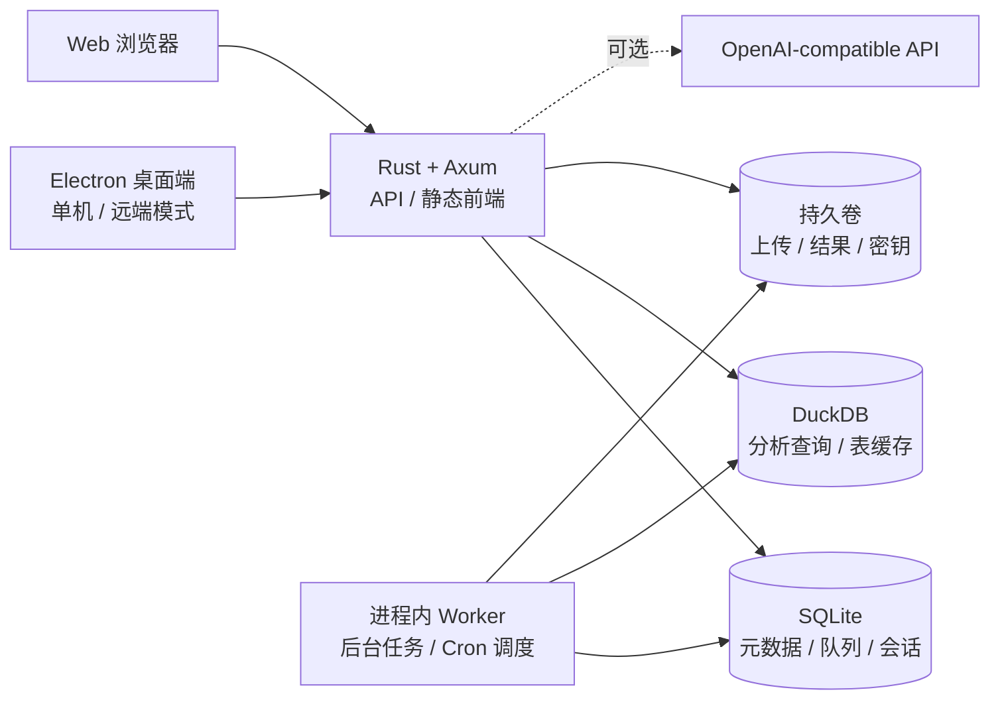

<p align="center">
  
</p>

<h1 align="center">AnyDatas</h1>

<p align="center">
  面向 Excel / CSV 的本地优先数据分析工作台<br>
  把数据导入、SQL 分析、AI 协作、图表展示和计划任务收进一个轻量应用
</p>

<p align="center">
  <a href="https://github.com/Ling0925/AnyDatas/actions/workflows/ci.yml"></a>
  
  
  
  
</p>

<p align="center">
  <a href="#快速开始">快速开始</a> ·
  <a href="#核心能力">核心能力</a> ·
  <a href="#系统架构">系统架构</a> ·
  <a href="#本地开发">本地开发</a> ·
  <a href="#部署与运维">部署与运维</a> ·
  <a href="docs/README.md">项目文档</a>
</p>

---

## AnyDatas 是什么？

AnyDatas 解决的是一条常见但容易碎片化的分析链路：拿到 Excel / CSV 后，需要先确认 Sheet、范围和字段类型，再跨文件写 SQL、反复调整结果，最后把查询转成可复用任务。

它把这条链路收敛成一个桌面工作台：

1. 上传 Excel 或 CSV，选择 Sheet 与单元格范围。
2. 在正式导入前检查样本并修正字段类型。
3. 使用 DuckDB SQL 跨文件、跨 Sheet 分析数据。
4. 用计算字段或可选的 QuickJS 对结果继续加工。
5. 将结果展示为表格或图表，并导出 CSV。
6. 保存查询，转为后台任务或 Cron 计划运行。

当前代码以 **Rust + Vue 3 重写版** 为主，位于 `backend/`、`frontend/` 和 `desktop/`。`app/`、`templates/`、`static/` 中的 Python / FastAPI 版本仅作为迁移参考。

> [!IMPORTANT]
> 项目仍处于积极迭代阶段。当前 MVP 已覆盖完整分析主路径，但成员管理、持久化报表、外部数据库和 Python 运行时等平台化能力尚未迁移。

## 核心能力

| 能力 | 当前支持 |
| --- | --- |
| 数据导入 | Excel（`.xlsx`、`.xls`、`.xlsb`、`.ods`）与 CSV；Sheet / 范围选择、样本预览、字段推断与类型修正 |
| 数据分析 | DuckDB SQL、跨文件 / 跨 Sheet 查询、自连接、计算字段、可复用查询 |
| 结果加工 | 服务端 QuickJS `process(rows, meta)`、受控 `http.request`、统一限额与网络白名单 |
| 可视化与导出 | 结果表格、柱状 / 折线 / 面积 / 饼图 / 散点 / 雷达图、公式安全的 CSV 导出 |
| 后台任务 | 持久队列、进度与日志、完整结果制品、分页、停止、重试、保留与删除 |
| 计划运行 | 多表 Cron 计划、时区、启停、编辑和立即运行 |
| AI 协作 | OpenAI Chat Completions 兼容配置、持久会话、原生工具、流式步骤、取消与重试 |
| 身份与治理 | 首次初始化、密码登录、HttpOnly 会话、登录限流、工作区 RBAC、密钥加密 |
| 桌面运行 | Electron 单机 / 远端双模式、Release 下载与 SHA-256 校验、子进程生命周期管理 |
| 可观测与恢复 | 健康检查、Prometheus 指标、请求 ID、告警规则、一致性备份与校验恢复 |

### 设计取向

- **本地优先**：默认只监听 `127.0.0.1`，适合个人电脑或可信私网部署。
- **单机优先**：一个 Rust 进程提供 API、前端、后台 Worker 和调度器。
- **分析优先**：SQLite 管理元数据，DuckDB 负责分析计算，源表缓存可复用。
- **依赖克制**：MVP 不要求 Redis、Kubernetes、Temporal、外部 Worker 或 Docker Socket。
- **可恢复**：数据文件、元数据、任务结果和密钥统一进入持久卷，并提供一致性备份工具。

## 快速开始

### 使用 Docker Compose

准备 Docker 与 Docker Compose，然后执行：

```bash
git clone https://github.com/Ling0925/AnyDatas.git
cd AnyDatas
cp .env.example .env
docker compose up --build -d
curl --fail http://127.0.0.1:28080/api/readyz
```

浏览器打开 [http://127.0.0.1:28080](http://127.0.0.1:28080)。首次访问会引导创建 Owner 账号和默认工作区，密码至少需要 12 个字符。

停止服务：

```bash
docker compose down
```

默认数据保存在 Docker 的 `anydatas-data` 持久卷中，执行 `docker compose down` 不会删除该卷。

> [!NOTE]
> 当前 Docker 包固定为 Linux x64。Apple Silicon 上的 Docker Desktop 会通过 x64 模拟运行。

## 系统架构



| 层级 | 技术 | 职责 |
| --- | --- | --- |
| 后端 | Rust 1.97、Axum、Tokio | HTTP API、认证、静态资源、任务与调度 |
| 元数据 | SQLite、SQLx | 用户、工作区、查询、队列、计划与迁移 |
| 分析引擎 | DuckDB 1.5.4、Calamine | 表格解析、缓存、跨表 SQL 与结果生成 |
| 结果后处理 | QuickJS | 在受控资源和网络策略下加工查询结果 |
| Web 前端 | Vue 3、TypeScript、Vite、Pinia | 数据工作台、任务管理与 AI 对话 |
| UI 与图表 | Element Plus、Monaco Editor、ECharts | 桌面交互、SQL 编辑和结果可视化 |
| 桌面端 | Electron | 本地服务管理、远端连接和桌面打包 |

更完整的模块边界与实现状态见 [Rust + Vue 重构设计](docs/14-rust-vue-rewrite.md)。

## 本地开发

### 环境要求

- Rust 1.97+
- Python 3（用于下载并验证预编译 DuckDB）
- Node.js 24+
- pnpm 11+

### 1. 启动后端

```bash
python3 scripts/with-duckdb-prebuilt.py -- \
  cargo run --manifest-path backend/Cargo.toml
```

包装脚本会下载固定版本的 `Ling0925/duckdb-prebuilt`，依次验证 Release 清单、压缩包、包元数据和静态库 SHA-256，然后缓存到 `.cache/duckdb-prebuilt/`。不支持的平台会明确失败，不会回退到未经验证的系统 DuckDB。

### 2. 启动前端

在另一个终端执行：

```bash
pnpm --dir frontend install --frozen-lockfile
pnpm --dir frontend dev
```

打开 [http://127.0.0.1:5173](http://127.0.0.1:5173)。Vite 开发服务器会代理后端 API。

### 3. 验证生产前端

```bash
pnpm --dir frontend build
ANYDATAS_WEB_DIR=frontend/dist python3 scripts/with-duckdb-prebuilt.py -- \
  cargo run --manifest-path backend/Cargo.toml
```

打开 [http://127.0.0.1:8080](http://127.0.0.1:8080)，此时静态前端由 Rust 服务直接提供。

### Electron 桌面端

```bash
pnpm --dir desktop install --frozen-lockfile
pnpm --dir desktop dev
```

未设置 `ANYDATAS_API_TARGET` 时会显示单机 / 远端运行模式选择器。

构建 Windows x64 安装包：

```bash
pnpm --dir desktop package:win
pnpm --dir desktop verify:win-package
```

产物位于 `desktop/release/AnyDatas-Setup-<version>-x64.exe`。当前安装包尚未签名，Windows SmartScreen 可能要求用户手动确认。

<details>
<summary><strong>桌面 Release 约定</strong></summary>

推送 `desktop-v<desktop/package.json version>` 标签会触发 Windows 桌面版 Release。单机模式下载的服务端版本固定在 `desktop/src/main.ts`；如需拆分服务端仓库，可设置 `ANYDATAS_SERVER_REPOSITORY=owner/repository`。

私有 Release 的开发测试可通过进程环境提供 `ANYDATAS_GITHUB_TOKEN`，但生产客户端不得内置 GitHub Token。

</details>

## 部署与运维

### 网络与安全

Docker 默认绑定 `127.0.0.1:28080`。需要从局域网或 Tailscale 访问时，在 `.env` 中设置：

```dotenv
ANYDATAS_HOST_BIND=192.168.1.10
ANYDATAS_PORT=28080
```

公网或正式 HTTPS 部署应置于可信反向代理之后，并设置 `ANYDATAS_COOKIE_SECURE=1`。不要直接把未配置 TLS 的服务暴露到公网。

完整的资源、查询、QuickJS 和存储限制可在 [.env.example](.env.example) 中调整。

### 数据目录

`anydatas-data` 卷包含：

- 上传文件和导入暂存文件
- 每张逻辑表的 DuckDB 缓存
- SQLite 元数据、用户和会话
- 保存查询、任务结果和计划
- 本地 AI 密钥文件 `.secret-key`

恢复时必须同时保留 `.secret-key`，否则已保存的 AI 凭据将无法解密。

### 备份与恢复

在线创建一致性备份：

```bash
docker compose -f docker-compose.yml -f docker-compose.operations.yml \
  --profile tools run --rm backup
```

恢复需要维护窗口。先停止应用，再选择 `backups/` 中的归档：

```bash
docker compose stop anydatas
ANYDATAS_RESTORE_ARCHIVE=anydatas-backup-20260726T000000Z.tar.gz \
  docker compose -f docker-compose.yml -f docker-compose.operations.yml \
  --profile tools run --rm restore
docker compose up -d anydatas
curl --fail http://127.0.0.1:28080/api/readyz
```

恢复工具会校验归档、逐文件哈希和 SQLite 完整性，并在安装成功前保留卷内回滚副本。详细步骤见 [单机部署方案](docs/11-single-server-deployment.md)。

### 监控

复制 `monitoring/metrics-token.example` 为 `monitoring/metrics-token`，替换为足够长的随机 Token，设置 `ANYDATAS_GRAFANA_ADMIN_PASSWORD` 后启动监控覆盖层：

```bash
docker compose -f docker-compose.yml -f docker-compose.monitoring.yml up -d
```

Prometheus 通过 Compose 内部网络读取受保护的 `/api/metrics`，Grafana 和 Prometheus 默认仅监听本机。

## 质量验证

```bash
cargo fmt --manifest-path backend/Cargo.toml --all --check
python3 scripts/with-duckdb-prebuilt.py -- \
  cargo test --manifest-path backend/Cargo.toml --locked
python3 scripts/with-duckdb-prebuilt.py -- \
  cargo clippy --manifest-path backend/Cargo.toml --all-targets --locked -- -D warnings
python3 -m unittest discover -s ops_tests -v
pnpm --dir frontend build
pnpm --dir desktop typecheck
pnpm --dir desktop test
docker compose config --quiet
```

CI 会对后端格式、测试和严格 Clippy，前端构建，桌面端类型与测试，以及运维脚本执行自动验证。

## 项目结构

```text
AnyDatas/
├── backend/       # 当前 Rust / Axum 后端与数据库迁移
├── frontend/      # 当前 Vue 3 数据分析工作台
├── desktop/       # Electron 桌面客户端与发行脚本
├── docs/          # 产品、架构、实现和运维文档
├── scripts/       # DuckDB、备份、恢复和升级工具
├── ops_tests/     # 运维与构建链测试
├── monitoring/    # Prometheus / Grafana 配置与告警规则
├── app/           # 旧 Python 实现，仅作为迁移参考
├── templates/     # 旧服务端模板，仅作为迁移参考
└── static/        # 旧前端静态资源，仅作为迁移参考
```

## 路线图

| 状态 | 方向 |
| --- | --- |
| ✅ 已完成 | Excel / CSV 分析主路径、多表 SQL、图表、AI Agent、后台任务、Cron、桌面双模式 |
| 🚧 计划中 | 成员管理、邀请、角色调整和多工作区切换 |
| 📋 待规划 | 持久化 Dashboard / Report、XLSX / PDF 导出、分享与订阅 |
| 📋 待规划 | 外部数据库、S3 / MinIO、Python 运行时和通知通道 |
| 📋 待规划 | 旧 Python / SQLite 数据迁移与迁移审计 |

路线图表示当前方向，不代表固定发布时间。详细验收边界见 [实现验收清单](docs/13-implementation-acceptance.md)。

## 延伸阅读

- [项目文档导航](docs/README.md)
- [Rust + Vue 重构设计与实施状态](docs/14-rust-vue-rewrite.md)
- [跨文件与跨 Sheet 分析](docs/15-cross-file-sheet-analysis.md)
- [导入、图表与 AI SQL](docs/16-import-charts-ai.md)
- [AI Agent Runtime](docs/17-ai-agent-runtime.md)
- [Electron 本地采集 Agent](docs/18-electron-local-collector.md)
- [桌面双模式与服务端运行时](docs/19-desktop-runtime-modes.md)

---

<p align="center">
  <strong>AnyDatas</strong> · 让散落的数据，变成可以持续运行的分析流程
</p>
