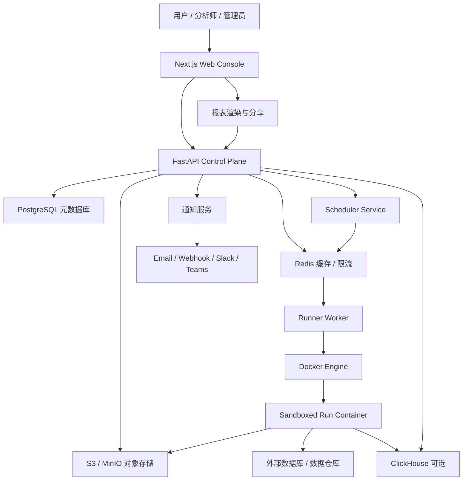
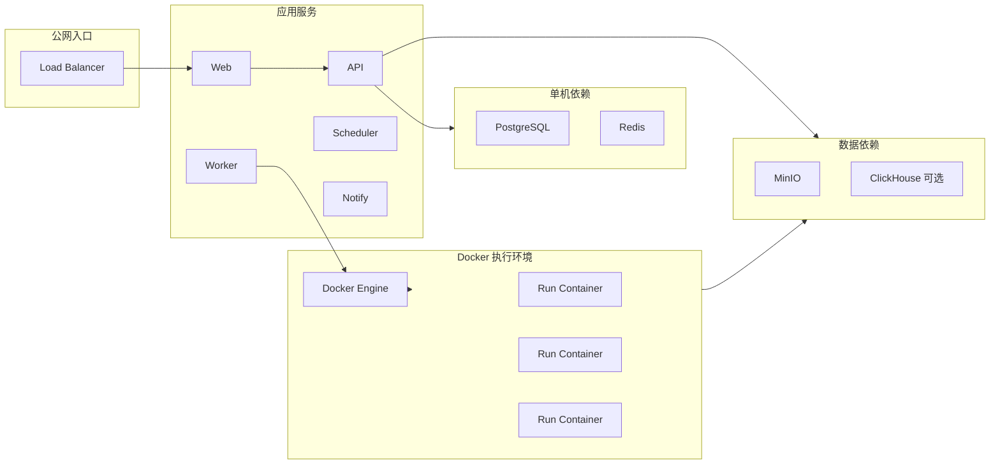

# 04 架构设计

## 总体架构

## 组件职责

| 组件 | 职责 |
| --- | --- |
| Web Console | 项目管理、数据源管理、脚本编辑、运行历史、报表编辑、权限管理 |
| Control Plane API | 鉴权、权限、元数据、调度配置、运行触发、报表配置 |
| PostgreSQL | 核心事务元数据和权限模型 |
| S3/MinIO | 原始文件、脚本包、运行产物、报表快照、导出文件 |
| Scheduler Service | 调度计划、运行生命周期、重试、补跑、并发策略 |
| Runner Worker | 从队列领取运行任务，创建 Docker 运行容器，回收状态和产物 |
| Docker Run Container | 隔离执行用户 SQL/Python 任务 |
| ClickHouse | 可选组件，用于运行事件、指标、日志索引、大结果集和审计分析 |
| Notification Service | 失败通知、成功订阅、报表分发 |
| Report Renderer | 图表和页面渲染，读取快照或查询结果 |

## 关键数据流

### 文件上传

1. 前端请求上传 URL。
2. API 创建 `data_source` 和 `data_asset` 草稿记录。
3. 文件直传 S3/MinIO。
4. API 创建 schema inference 任务。
5. Runner 创建一次性容器，使用 DuckDB/Pandas 读取样本，生成 schema、预览和质量报告。
6. 用户确认字段类型后，数据源可用于脚本。

### 手动运行

1. 用户保存脚本版本。
2. 前端调用 `POST /runs`。
3. API 校验权限、配额、数据源访问和密钥引用。
4. API 创建 `run` 记录并把任务写入 Redis Queue。
5. Runner Worker 创建 Docker 运行容器。
6. 容器拉取脚本包和配置，执行代码。
7. 容器将日志、结果表、图表数据和产物写回对象存储，必要时写入 ClickHouse。
8. Runner Worker 更新运行状态。
9. 前端通过轮询或 WebSocket/SSE 获取状态。

### 定时运行

1. 用户创建 schedule，指定 cron/interval、时区、重试和并发策略。
2. API 保存 schedule。
3. Scheduler Service 按时区扫描到期计划并创建运行记录。
4. Scheduler Service 将任务写入 Redis Queue，后续执行同手动运行流程。
5. 成功后更新报表快照，失败后触发通知。

### 报表打开

1. 用户打开报表链接。
2. API 校验报表权限和数据权限。
3. 报表读取最近成功运行快照和图表配置。
4. 如果报表设置为打开时刷新，则触发受控运行或读取缓存。
5. 前端渲染指标卡、图表、表格和 Markdown。

## 核心实体

| 实体 | 说明 |
| --- | --- |
| organization | 租户或公司 |
| workspace | 团队空间，可拥有成员、项目和数据源 |
| user | 用户 |
| membership | 用户在组织/工作区内的角色 |
| data_source | 数据源连接或文件集合 |
| data_asset | 具体表、文件、视图或查询结果 |
| secret_reference | 密钥引用，只保存部署环境变量名和描述，不存明文到业务表 |
| project_secret_binding | 项目到密钥引用的运行时变量绑定；项目版本和运行只保存其快照 |
| project | 分析项目 |
| project_version | 已保存或已发布代码版本 |
| run | 一次运行 |
| run_artifact | 运行产物，如结果表、图表数据、日志、导出文件 |
| schedule | 定时计划 |
| report | 报表定义 |
| report_snapshot | 报表某次刷新后的静态快照 |
| audit_event | 审计事件 |

当前单机 MVP 的密钥值由控制平面进程的 `ANYDATAS_SECRET_*` 部署环境变量提供。项目只能把引用绑定到 `ANYDATAS_USER_SECRET_*` 运行时变量；Runner 会清除继承的密钥变量，再仅注入本次运行的绑定值。该边界保证控制平面数据库、项目版本、运行记录和审计详情都不保存密钥明文。

## 部署拓扑

## 多租户策略

MVP 可采用共享控制平面、逻辑租户隔离:

- 所有业务表带 `organization_id` 和 `workspace_id`。
- 应用层每次查询强制租户过滤。
- PostgreSQL RLS 作为第二道保护。
- 对象存储路径按租户和工作区分区。
- 运行容器按租户注入最小权限的短期凭证。
- 企业版可支持租户独立命名空间、独立对象桶或独立数据库。

## API 草案

| 模块 | 示例接口 |
| --- | --- |
| Auth | `POST /auth/login`、`POST /auth/logout`、`GET /me` |
| Workspace | `GET /workspaces`、`POST /workspaces` |
| Data Source | `POST /data-sources`、`GET /data-sources/{id}`、`POST /uploads/presign` |
| Project | `POST /projects`、`PUT /projects/{id}/draft`、`POST /projects/{id}/publish` |
| Run | `POST /runs`、`GET /runs/{id}`、`GET /runs/{id}/logs`、`POST /runs/{id}/cancel` |
| Schedule | `POST /schedules`、`PATCH /schedules/{id}`、`POST /schedules/{id}/pause` |
| Report | `POST /reports`、`GET /reports/{id}`、`POST /reports/{id}/publish` |
| Admin | `GET /admin/audit-events`、`GET /admin/usage`、`PATCH /admin/quotas` |

## 架构演进

第一阶段应把架构压在少数组件内: Web、API、Scheduler、Runner Worker、PostgreSQL、Redis、MinIO、Docker Engine。ClickHouse 可在 MVP 后半段引入，优先用于运行事件和大结果集。Temporal、Kubernetes、Trino、Spark、Airbyte、Dagster 等组件应作为后续扩展，而不是第一天的强依赖。
