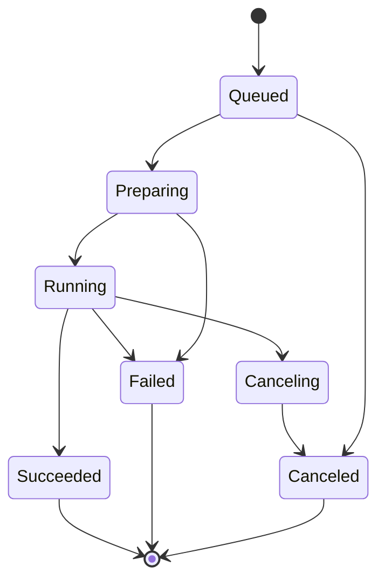

# 05 数据接入与执行设计

## 数据接入范围

### MVP 数据源

| 类型 | 支持内容 | 说明 |
| --- | --- | --- |
| 文件 | CSV、XLSX、Parquet | 文件上传是最短路径，必须体验顺畅 |
| 本地数据库 | SQLite 表/视图 | 当前 MVP 可用，适合本机或受控挂载路径 |
| 外部数据库 | PostgreSQL schema/table、MySQL database/table | 当前 MVP 可用，连接 URL 通过外部 Secret 引用提供，只读连接优先 |
| 分析库 | ClickHouse | 当前支持外部只读表连接；作为内部结果库后续实现 |
| 对象存储 | S3/MinIO CSV/XLSX/Parquet 对象 | 当前支持受控快照导入与显式刷新；平台内部产物存储后续实现 |

### 后续数据源

- Snowflake、BigQuery、Redshift、SQL Server、Oracle。
- Google Sheets、Airtable、HTTP API。
- Airbyte/dlt 连接器。
- 用户上传压缩包和多文件数据集。

## 文件上传流程

上传后平台应生成:

- 原始文件对象路径。
- 文件大小、hash、上传者、上传时间。
- schema 推断结果。
- 数据预览，默认前 100 行。
- 质量摘要: 空值比例、重复行估算、字段类型冲突、编码问题。
- 可查询引用名，如 `uploaded.sales_2026_q1`。

当前 MVP 已支持上传或从 S3/MinIO 快照导入的 CSV/XLSX/Parquet，以及 SQLite、PostgreSQL、MySQL 和 ClickHouse 数据源的 Schema 页面：推断 `text`、`integer`、`number`、`boolean`、`date`、`datetime` 类型，展示质量样本与预览，并允许管理者保存字段类型、描述、`pii`/`financial`/`customer`/`sensitive` 分类和 `redact`/`partial`/`hash` 导出脱敏策略。该编辑只更新平台元数据，不修改原始文件、远端对象或连接表。

字段策略当前作用于导出：无数据源 `manage` 权限的成员下载运行结果或报表 CSV/JSON/XLSX/PNG/PDF 时统一脱敏，管理者保留原值导出；分析运行和页面预览仍使用原值。审计记录实际脱敏的输出列。跨 SQL 别名传播和源数据库行列策略属于后续血缘增强。

### 当前 S3/MinIO 快照边界

Owner/Admin 登记的 Secret Reference 值是 JSON 对象，包含 `access_key_id`、`secret_access_key`、可选 `session_token`、`endpoint_url`、`region` 和 `addressing_style`。Analyst 只能选择已有引用并填写 bucket 与以 `.csv`、`.xlsx`、`.parquet` 结尾的 object key。控制平面先执行 `HeadObject` 大小检查，再使用 VersionId 或 ETag 条件流式下载，并在写入时重复执行 `ANYDATAS_MAX_UPLOAD_BYTES` 上限。凭据 JSON 不落库、不回显、不进入 Runner；数据源只保存引用 id、bucket/key、格式、大小、ETag、version 和修改时间。

导入是可复现的本地快照，不是每次运行直读远端对象。具备 `manage` 权限的成员可以显式刷新；新对象必须完整下载并通过 Schema/质量检查后才替换旧快照，失败则保留旧数据。CSV/Parquet 保持原格式，XLSX 保留原文件并生成私有 CSV 运行副本。Docker Runner 只读挂载本地快照并保持 `--network none`，因此用户脚本拿不到 S3 凭据或对象存储网络。对象存储作为上传、运行产物和报表快照的内部存储仍属后续阶段。

### 当前 PostgreSQL/MySQL/ClickHouse 连接边界

Owner/Admin 先登记其部署环境变量引用，PostgreSQL 值是完整的 `postgres://` 或 `postgresql://` URL，MySQL 值是 `mysql://` 或 `mysql+pymysql://` URL，ClickHouse 值是 HTTP `clickhouse://` 或 HTTPS `clickhouses://` URL；三者都必须包含用户名。Analyst 创建数据源时只能选择已有引用并填写受限 schema/database + table 标识；接入会执行只读预览和行数检查。数据源元数据仅保存引用 id、schema/database、table 和自动生成的运行时变量名，绝不保存 URL 或密码。

运行时 SQL 仍使用 `$name` 参数约定，平台为 PostgreSQL/MySQL 改写为 DB-API 命名参数，为 ClickHouse 改写为字符串、整数、数字或布尔类型的服务端参数；Python 使用 `load_data()`。SQL 仅允许单条只读查询，平台拒绝 DDL、DML、session-control、系统操作、锁定查询和多语句；MySQL 还拒绝可执行注释。PostgreSQL/MySQL 在 read-only transaction 中执行并设置数据库侧超时；ClickHouse 使用 `readonly=1`、`max_execution_time`、`max_result_rows=500` 和 `result_overflow_mode=break`。接入预检使用 5 秒连接/查询超时。Local Runner 从开发主机连接；Docker Runner 默认拒绝这类数据源，直到运维者显式配置只包含已批准数据库路径的 `ANYDATAS_DOCKER_DATABASE_NETWORK`。文件和 SQLite 数据源仍保持无网络容器运行。

对大型文件:

- 前端分片或直传对象存储。
- 后台异步推断 schema。
- 优先转换为 Parquet 以便后续查询。
- 预览和完整数据处理分离。

## 数据源权限

数据源权限分三层，当前 MVP 已实现:

1. `view`（可见）: 用户能看到数据源名称、Schema、质量摘要和预览。
2. `query`（可查询）: 用户还能使用绑定该数据源的项目、运行、结果和报表快照。
3. `manage`（可管理）: 用户还能更新 Schema、可见性和成员授权。

新建数据源默认 `workspace` 可见，创建者与 Owner/Admin 自动拥有 `manage`，其余工作区成员拥有 `query`；原有角色仍决定谁可以创建项目、手动运行和创建数据源。管理者可将数据源改为 `private`，并给指定成员授予 `view`、`query` 或 `manage`。Viewer 的显式授权只允许 `view`。旧数据源未记录创建者时保留原有 Analyst 可管理行为；首次将其改为 `private` 的管理者会成为记录创建者，避免迁移时扩大阻断面或把操作者锁在资源之外。

平台在数据源详情、项目编辑/发布/运行、定时任务、运行结果下载、报表快照、通知和审计读取中重复执行这一授权判断；不是只隐藏前端入口。私有源权限降级或撤销后，关联报表订阅和定向通知会被清理，投递前也会再次校验。

数据源管理者可以在详情页查看跨项目影响：草稿是否使用、发布版本是否使用、历史版本数、启用调度、当前可见报表和历史运行数。草稿切换数据源不会掩盖仍由旧发布版本驱动的调度和报表依赖。

数据库连接应默认要求只读账号。平台侧对 SQL 进行基础限制，例如禁止多语句、禁止 DDL/DML，真正安全仍依赖数据库账号权限。

## 分析项目模型

MVP 采用脚本项目:

- `main.sql` 或 `main.py`。
- 参数定义，如日期范围、地区、部门。
- 数据源引用。
- 输出定义，如 result table、chart spec、markdown summary。
- 环境定义，如 Python 包和运行镜像。
- 已保存版本和已发布版本。

### 当前 MVP 参数契约

当前实现把参数作为 JSON 对象保存在项目、不可变 `project_version` 和每个 `run` 记录中。这样手动运行、定时运行和报表刷新都会留下可复现的参数快照。

- SQL 使用 `$name` 占位符，并由 DuckDB/SQLite 做安全绑定，不拼接原始 SQL 文本。
- Python 代码通过 `params["name"]` 读取同一个 JSON 对象。
- 参数名限定为字母或下划线开头，后续可接字母、数字或下划线；值可表达文本、数值、日期字符串和布尔值。

### 当前 Python 依赖边界

平台不允许用户在运行时提交任意 `pip install`。运维者通过 `ANYDATAS_RUNTIME_PROFILES_JSON` 登记已经构建、扫描并包含平台 wrapper 契约的 Docker 镜像，用户只选择 profile id。`standard` 始终映射 `ANYDATAS_RUNTIME_IMAGE`；自定义 profile 仅支持 Docker Runner。profile 随项目版本固化，发布版本、定时任务、重试和补跑都继续使用该版本的镜像选择。

P2 可扩展为 Notebook:

- 多 cell。
- cell 依赖。
- 交互式运行。
- 协同编辑。
- Notebook 发布为 App。

## 执行生命周期

当前 MVP 已实现 `queued`、`running`、`succeeded`、`failed`、`canceling` 和 `canceled` 状态。手动项目与手动 schedule 触发会先创建 queued run，再交由后台执行；分析师、管理员和 Owner 可从运行详情取消。工作区运行并发上限会统计 `running` 和 `canceling`，满额时手动、自动和重试 run 保持 queued，直到调度器领取空闲槽位。queued run 可以立即取消，LocalSubprocessRunner 终止本地子进程，DockerRunner 删除命名运行容器。`canceling` 会继续占用同一 schedule 和工作区的并发槽，直到任务真正结束。取消不会创建 retry、失败通知或报表快照。

运行记录必须保存:

- 触发方式: manual、schedule、api、backfill。
- 触发人或 schedule id。
- project_version id。
- parameters JSON 快照。
- 数据源版本或快照引用。
- runtime image。
- 环境变量和 secret 引用摘要。
- start/end time、duration、status、exit code。
- CPU、memory、network、storage 用量。
- 日志、错误摘要、产物路径。

当前单机 MVP 的运行详情按 100 行分页展示结果表、按 200 行分页展示日志；两个分页状态可独立切换，CSV/JSON 导出仍提供完整的已授权结果。结构化日志字段、集中检索和长期留存策略后续接入。

### 当前 MVP 的密钥运行边界

`secret_references` 仅登记部署环境变量的引用，`project_secret_bindings` 将其绑定为项目运行时的 `ANYDATAS_USER_SECRET_*` 变量。绑定和解绑都会形成新的项目版本；手动、定时和重试运行都保存只含引用 id 与目标变量名的快照。Runner 启动前移除所有继承的 `ANYDATAS_SECRET_*` / `ANYDATAS_USER_SECRET_*` 变量，仅注入快照中已解析的值；日志、结果和异常在保存前按已解析值脱敏。若部署环境没有配置对应值，运行会在执行脚本前失败，并保留不含明文的错误摘要。引用在仍被当前绑定、未结束运行或已发布版本使用时不能删除；解绑后必须发布新版本，避免下一次运行意外失去凭证。

## 执行沙箱

用户代码默认视为不可信。单机 MVP 中，每次运行使用独立 Docker 容器，并应用以下限制:

- 非 root 用户运行。
- 禁止 privileged container。
- 只读 root filesystem，必要目录使用临时卷。
- 限制 CPU、内存、临时存储和运行时长。
- 仅挂载受控的单次运行目录和只读数据源目录。
- 默认隔离网络，仅允许访问授权数据源和对象存储。
- PostgreSQL、MySQL、ClickHouse 数据源仅在运维者配置受控 Docker network 后运行；上传文件与 S3/MinIO 本地快照保持 `--network none`。
- 注入短期凭证，不注入长期云密钥。
- 可选启用 rootless Docker 或 gVisor `runsc` 增强隔离。
- 每次运行结束清理容器和临时卷。

## 网络策略

默认策略:

- 运行容器不能访问控制平面内部数据库。
- 运行容器只能访问对象存储、日志收集端点和被授权的数据源。
- 公网访问默认关闭。
- 如果业务需要访问外部 API，管理员配置 egress allowlist。

这样可以降低 SSRF、横向移动、数据外泄和滥用算力风险。

## 调度语义

定时任务支持:

- cron 表达式。
- interval，如每 15 分钟、每 1 小时。
- 时区。
- start/end time。
- 暂停/恢复。
- 手动触发。
- 指定时间范围的补跑 backfill。
- 重试次数、重试间隔、超时。
- 并发策略:
  - skip: 前一次未完成则跳过。
  - queue_one: 只保留一个待运行。
  - queue_all: 保留每个到期触发并串行执行。
  - cancel_previous: 取消旧任务。
  - allow_parallel: 后续能力。

当前单机 MVP 已支持每个 schedule 配置 0 到 10 次重试和 1 到 1440 分钟的基础延迟。自动运行失败后会创建可追溯的 retry run，按指数退避计算下一次运行时间，单次延迟上限为 24 小时；只有最终失败才发送站内失败通知。

并发策略当前支持:

- 工作区运行上限: Owner/Admin 可配置；默认每工作区 2 个运行槽。所有 `running` 和 `canceling` run 共用该上限，领取操作在 SQLite 写事务中原子完成，避免单机多后台任务超额启动。
- `skip`: 同一 schedule 已有 queued/running/canceling run 时，跳过本次到期触发并写入 `schedule.run_skipped` 审计。
- `queue_one`: 运行中的任务后最多保留一个 queued run；已有 queued run 时跳过新的到期触发。
- `queue_all`: 每次到期都创建独立 queued run；同一 schedule 仍只会有一个 running/canceling run，因此积压按 `scheduled_for_at` 串行释放，不会丢弃到期触发。
- `cancel_previous`: 到期时将旧 queued run 标记为 canceled，并向旧 running/canceling run 发出取消请求；最新 run 先进入 queued，直到旧执行实际结束才占用执行槽。每次替换会记录 `schedule.run_superseded` 审计。
- 手动 "Run Now" 始终创建显式 run；后续自动 `cancel_previous` 触发可以替换同一 schedule 的旧 run。

补跑通过 schedule 的 Backfill 页面指定起止时间和 1 到 100 的 run 上限。页面的分钟精度结束时间按该分钟末尾处理。interval 以 schedule 创建时间为锚点，cron 以 schedule 时区计算历史 occurrence。每个 backfill run 都保留 `scheduled_for_at`，并在参数快照增加 UTC ISO-8601 值 `__anydatas_scheduled_for`；SQL 可使用 `$__anydatas_scheduled_for`，Python 可从 `params` 读取。backfill 使用同一 schedule、工作区运行槽和重试配置，但不会以历史结果覆盖当前报表快照。

关联项目的 interval、cron、手动触发 schedule 和成功的 schedule retry 会自动写入每个关联报表的新快照。backfill 及其 retry 不会更新报表快照。中间失败且仍会重试时不写失败快照；最终失败会写入失败快照，但报表继续展示最近成功数据和最新失败原因。

后续如果需要多节点高可用调度，可迁移到 Temporal Schedule。

## 运行产物

| 产物 | 存储 | 用途 |
| --- | --- | --- |
| stdout/stderr | Loki 或对象存储，ClickHouse 建索引 | 排查失败 |
| result dataframe | Parquet in S3/MinIO，必要时入 ClickHouse | 报表和二次分析 |
| chart spec | PostgreSQL + 对象存储 | 前端渲染 |
| report snapshot | 对象存储 | 快速打开和导出 |
| metrics | ClickHouse/Prometheus | 成本和性能分析 |

## 资源配额

MVP 默认配额建议:

| 维度 | 默认值 |
| --- | --- |
| 单次运行最大时长 | 30 分钟 |
| 单次运行 CPU | 1 到 2 vCPU |
| 单次运行内存 | 2 到 4 GB |
| 单工作区并发运行数 | 2 |
| 单工作区数据源存储 | 10 GiB |
| 单文件上传大小 | 500 MB 起步 |
| 每日运行次数 | 按套餐或管理员配置 |

当前单机版允许 Owner/Admin 配置数据源存储额度。额度统计平台托管的上传文件与 S3/MinIO 快照；XLSX 原文件和运行 CSV 均计入，重复路径只计一次。超过额度的上传和导入会清理临时文件，刷新则以新快照替换旧快照计算。企业版继续增加队列、优先级、独立执行机和预算。
