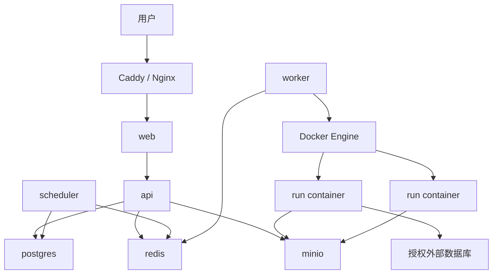

# 11 单机部署方案

## 结论

MVP 默认应支持单台 Linux 服务器部署，不默认依赖 Kubernetes。单机部署使用 Docker Compose 管理平台服务，使用 Docker Engine 为每次用户脚本运行创建短生命周期容器。这样能保留执行隔离、资源限制和可追溯运行记录，同时显著降低安装、升级和运维门槛。

Kubernetes Jobs 适合作为企业版或 SaaS 规模化后的执行后端，而不是第一版默认架构。

## 当前 MVP 运维入口

当前仓库的 Compose 文件运行控制平面和 runtime 镜像，持久化数据放在宿主机 `var/` 卷中。`GET /healthz` 和 `GET /readyz` 会检查应用与 SQLite 是否可用，Compose 以 `/healthz` 作为容器健康检查。

单机 SQLite 数据和上传/运行产物可使用仓库脚本备份：

```bash
python scripts/backup.py --output-dir /mnt/anydatas-backups
```

该脚本通过 SQLite online backup API 生成一致数据库副本，再打包数据目录其余内容，并写出 SHA-256 校验文件。恢复前必须停掉应用；恢复命令需要显式 `--force`，并会校验归档路径：

```bash
docker compose down
python scripts/restore.py /mnt/anydatas-backups/anydatas-backup-YYYYMMDDTHHMMSSZ.tar.gz --force
docker compose up -d
```

建议把备份目录放在独立挂载盘或远端同步目标，按周执行恢复演练。PostgreSQL 和 MinIO 版本的备份策略仍属于 Alpha/Beta 部署包。

运行目录和快照应设置保留期。先预览、再备份、最后显式应用：

```bash
docker compose exec -T anydatas python scripts/retention.py --keep-days 90
docker compose exec -T anydatas python scripts/backup.py
docker compose exec -T anydatas python scripts/retention.py --keep-days 90 --force
```

脚本只处理超过保留期的终态运行，保留运行状态、版本、参数、耗时和审计，清除结果、日志、错误与单次运行目录。历史报表快照清理时始终保留每个报表的最新状态和最近成功快照。建议先人工核对 preview JSON，再将备份与 `--force` 命令配置为同一周度运维任务；若存在无法删除的运行目录，命令以状态码 2 退出并列出路径。

## 单机密码认证

默认 `demo` 模式只适合本地评估，不得暴露给不可信网络。首次启动并初始化数据库后，在控制平面容器内通过临时环境变量设置 Owner 密码：

```bash
docker compose up -d
docker compose exec -T \
  -e ANYDATAS_INITIAL_PASSWORD='replace-with-a-long-random-password' \
  anydatas python scripts/set_password.py demo@anydatas.local \
  --password-env ANYDATAS_INITIAL_PASSWORD
```

然后在受权限保护的 `.env.secrets` 中加入并重启：

```dotenv
ANYDATAS_AUTH_MODE=password
ANYDATAS_SESSION_TTL_DAYS=7
ANYDATAS_COOKIE_SECURE=1
# Optional; keep 0 for invitation-only deployments.
ANYDATAS_ALLOW_SIGNUP=0
ANYDATAS_PASSWORD_RESET_TTL_HOURS=1
```

```bash
docker compose -f docker-compose.yml -f docker-compose.secrets.yml up -d
```

`ANYDATAS_COOKIE_SECURE=1` 要求用户通过 HTTPS 访问反向代理；纯 HTTP 本地验证才临时设为 0。密码只以 PBKDF2-HMAC-SHA256 随机盐哈希保存；会话 Cookie 为随机值，数据库仅保存 SHA-256 摘要和过期时间。密码模式忽略旧用户 id Cookie，未知认证模式会阻止应用启动。同一邮箱/客户端哈希键 15 分钟内失败 5 次会锁定 15 分钟，并返回 `Retry-After`。

Owner/Admin 在工作台创建成员邀请，原始链接只在创建成功页出现一次，之后数据库和待处理列表均只能看到摘要和元数据。默认 7 天过期；可在 `.env.secrets` 设置 `ANYDATAS_INVITATION_TTL_DAYS=1..30`。链接可撤销、接受后不可重放；现有账号需要当前密码，新账号设置初始密码，现有账号连续 5 次错误会自动撤销链接。密码 CLI 继续用于 Owner 恢复或紧急轮换；它不提供明文参数，修改密码同时撤销该用户全部会话。

默认 `ANYDATAS_ALLOW_SIGNUP=0` 保持邀请制。仅在确实需要开放自助注册时设为 1；注册用户会获得一个独立工作区和 Owner 角色，并沿用同一密码、会话摘要和审计策略。当前流程不验证邮箱所有权，直接面向公网时应继续关闭，或由反向代理/上游身份层限制注册入口。

普通已登录用户从工作台 **Account Security** 验证当前密码并执行日常轮换。成功后旧会话全部失效，仅当前浏览器获得新会话。

Owner 可为任意人工成员签发一次性密码重置链接，Admin 只能为 Analyst/Viewer 签发。链接默认 1 小时过期，可通过 `ANYDATAS_PASSWORD_RESET_TTL_HOURS=1..24` 调整；新链接撤销旧链接，成功重置会撤销目标用户全部会话和个人 API token。原始链接只在创建页显示，当前不会自动发邮件。Owner 自己无法登录时仍由受信任运维者使用 `scripts/set_password.py` 恢复。

同一面板可创建 1 到 365 天有效的个人 API token。原始 `anydatas_...` 值只显示一次，调用时使用：

```bash
curl -H "Authorization: Bearer $ANYDATAS_API_TOKEN" https://anydatas.example/api/notifications
```

数据库仅存 token 摘要、scope、到期、撤销与最近使用时间；每次请求实时读取当前工作区角色。新 token 默认 `read`，只允许 GET/HEAD/OPTIONS；仅在自动化需要创建、运行或修改资源时选择 `full`。创建和撤销必须使用密码浏览器会话，Bearer token 不能继续签发或撤销 token。两种 scope 均不会绕过成员角色，自动化仍应使用短有效期和最小角色账号。

Owner/Admin 可在 **Service Accounts** 创建独立 Viewer/Analyst 机器身份。服务账号没有密码、不能网页登录；初始和轮换 token 均只显示一次。停用会撤销该身份全部 token 并移除工作区 membership，已有资源和审计归属仍保留。建议默认 Viewer + Read only，仅在写入自动化确有需要时提升为 Analyst + Full access。

## 标准升级与回退

先切换到经过 CI 验证的目标 Git 版本，再从仓库根目录执行：

```bash
python scripts/upgrade.py
```

脚本依次校验 Docker Compose、在运行中的控制平面内生成一致性备份、构建镜像、执行 `docker compose up -d --remove-orphans`，并等待 `/readyz`。默认保留 30 天备份，可用 `--retention-days` 修改。启用了覆盖文件时必须按部署顺序重复传入，例如：

```bash
python scripts/upgrade.py \
  --compose-file docker-compose.yml \
  --compose-file docker-compose.secrets.yml \
  --compose-file docker-compose.database-network.yml
```

构建、重建或健康检查失败后脚本立即停止，并输出升级前备份位置。回退是显式运维动作：切回上一已验证 Git 版本，重新构建并启动；若新版本已修改数据且不能向后兼容，先停止服务，再使用该备份执行 `scripts/restore.py --force`。不要在服务运行期间恢复，也不要把自动数据覆盖作为升级失败的默认行为。

## 外部密钥引用

单机 MVP 不把密钥值写入 SQLite、项目版本或运行记录。运维者在控制平面容器环境中设置 `ANYDATAS_SECRET_*` 值，Owner/Admin 只在工作台登记引用，项目把引用绑定为 `ANYDATAS_USER_SECRET_*` 运行时变量。Runner 会删除继承的密钥变量，并只把当前运行已绑定的值传给用户脚本；落库日志、结果和错误会脱敏。

仓库提供一个不含任何值的 Compose 覆盖文件。首次部署时创建受权限保护的本地副本：

```bash
cp docker-compose.secrets.example.yml docker-compose.secrets.yml
printf '%s\n' 'ANYDATAS_SECRET_WAREHOUSE_PASSWORD=replace-with-a-real-value' > .env.secrets
chmod 600 docker-compose.secrets.yml .env.secrets
docker compose -f docker-compose.yml -f docker-compose.secrets.yml up -d --build
```

`.env.secrets` 和本地覆盖文件均被 Git 忽略。Docker socket 已经意味着控制平面容器和拥有 Docker 管理权限的宿主机用户是可信边界，因此不要在不受信任的多租户宿主机上依赖这个机制。需要更高隔离时，应使用外部 Secret Manager、短期凭证和独立执行节点。

## 邮件、Webhook、Slack 和 Teams 通知

Owner/Admin 在工作台添加邮件、通用 Webhook、Slack 或 Microsoft Teams 渠道。邮件收件人保存在工作区元数据中；SMTP 连接配置和密码只放在 `.env.secrets`，例如：

```dotenv
ANYDATAS_SMTP_HOST=smtp.example.com
ANYDATAS_SMTP_PORT=587
ANYDATAS_SMTP_FROM=anydatas@example.com
ANYDATAS_SMTP_USERNAME=anydatas@example.com
ANYDATAS_SMTP_PASSWORD=replace-with-a-real-password
```

默认使用 STARTTLS；对 465 等 SMTPS 端口设置 `ANYDATAS_SMTP_USE_SSL=1`，此时不要同时设置 `ANYDATAS_SMTP_STARTTLS=1`。通用 Webhook、Slack Incoming Webhook 和 Teams Workflow Webhook 都先通过 Secret References 注册，环境变量值必须是 HTTPS URL。生产环境保持 `ANYDATAS_ALLOW_INSECURE_WEBHOOKS` 未设置；它只用于本地 HTTP 接收器测试。

调度循环每 10 秒领取待投递任务。每个渠道可设置 0 到 10 次重试，基础间隔由 `ANYDATAS_NOTIFICATION_RETRY_DELAY_SECONDS` 控制，默认 60 秒并指数退避到最多 24 小时。部署时不要设置 `ANYDATAS_DISABLE_SCHEDULER=1`，否则计划任务和外部通知都不会自动投递。

## Prometheus 指标与告警

Owner/Admin 工作台包含工作区运行用量面板。若需要成本估算，在部署环境中设置单台执行资源的每小时人民币成本：

```dotenv
ANYDATAS_RUNNER_COST_PER_HOUR_CNY=2.50
```

平台按已记录任务 wall-clock 时长计算估算值；未配置、负数或非法值均按 0 处理。该数字用于单机容量和预算趋势，不应作为云厂商对账依据。

`GET /metrics` 使用 Prometheus text exposition 格式，包含控制平面、scheduler、数据源、运行状态、通知和外部投递队列的聚合指标。生产环境把以下值写入 `.env.secrets`：

```dotenv
ANYDATAS_METRICS_TOKEN=replace-with-a-long-random-token
```

Prometheus scrape 配置使用 Bearer header，例如：

```yaml
scrape_configs:
  - job_name: anydatas
    metrics_path: /metrics
    authorization:
      type: Bearer
      credentials: replace-with-a-long-random-token
    static_configs:
      - targets: ["anydatas.example.internal"]
```

将 `monitoring/anydatas-alerts.yml` 挂载到 Prometheus rule 文件目录，或复制其中的四条规则到现有告警仓库。它覆盖 API scrape 不可达、scheduler 停止、通知最终失败和投递积压。开发环境若显式关闭 scheduler，不应加载 scheduler 告警规则。指标不会包含工作区、用户、脚本或 Secret；仍应通过私有网络或反向代理限制 scrape 访问。

仓库也提供可选的单机监控叠加文件，固定 Prometheus/Grafana 镜像版本，预置数据源、告警和 **AnyDatas Single Server** dashboard。默认 Compose 不启动监控服务：

```bash
cp monitoring/metrics-token.example monitoring/metrics-token
chmod 600 monitoring/metrics-token
export ANYDATAS_GRAFANA_ADMIN_PASSWORD='replace-with-a-long-random-password'
docker compose -f docker-compose.yml -f docker-compose.monitoring.yml up -d --build
```

Grafana 和 Prometheus 分别只绑定 `127.0.0.1:3000`、`127.0.0.1:9090`，远程运维应使用 SSH tunnel，不应直接放开防火墙。Grafana 默认用户为 `admin`，可通过 `ANYDATAS_GRAFANA_ADMIN_USER` 修改；匿名访问和自助注册已关闭。Prometheus 保留 30 天数据，两个服务使用独立命名卷。轮换 `monitoring/metrics-token` 后执行：

```bash
docker compose -f docker-compose.yml -f docker-compose.monitoring.yml restart prometheus
```

停止并保留历史数据时使用 `down`；只有明确不再需要历史指标时才附加 `-v` 删除监控卷。

## 外部数据库数据源网络

PostgreSQL 数据源把完整 `postgres://`/`postgresql://` URL 作为 Secret Reference 的部署环境值；MySQL 使用 `mysql://`/`mysql+pymysql://` URL；ClickHouse 使用 HTTP `clickhouse://` 或 HTTPS `clickhouses://` URL。三者都必须包含用户名。接入时平台只保存引用 id、schema/database、table 和生成的运行时变量名；创建数据源会做只读表预览。PostgreSQL/MySQL 运行使用 read-only transaction，MySQL 还设置 `MAX_EXECUTION_TIME` 并拒绝可执行注释；ClickHouse 使用 `readonly=1`、查询超时和 500 行结果上限。必须使用数据库侧最小权限账号，平台不会代替数据库的授权模型。

Local Runner 从开发主机连接。Docker Runner 对文件、SQLite、XLSX 和 Parquet 继续使用 `--network none`；要运行 PostgreSQL、MySQL 或 ClickHouse 数据源，运维者必须创建并限制专用 Docker network，并将控制平面加入同一网络以便连接预检。仓库提供不默认启用的覆盖文件：

```bash
docker network create anydatas-database
cp docker-compose.database-network.example.yml docker-compose.database-network.yml
export ANYDATAS_DOCKER_DATABASE_NETWORK=anydatas-database
docker compose -f docker-compose.yml -f docker-compose.secrets.yml -f docker-compose.database-network.yml up -d --build
```

将目标 PostgreSQL/MySQL/ClickHouse 服务或经防火墙批准的路由加入这个网络，不能把它作为通用互联网出口。若数据库在 Docker 中运行，也要把该服务加入相同外部网络；若数据库位于宿主机或局域网，则由防火墙限制这个网络的可达地址。未设置该环境变量时，Docker Runner 会明确拒绝这些外部数据库运行，而不是退化为开放网络。

## S3/MinIO 快照导入

S3/MinIO 连接器不要求给 Runner 开放网络。把只读对象身份配置为 Secret Reference 对应的部署环境 JSON：

```bash
ANYDATAS_SECRET_S3_ANALYTICS='{"endpoint_url":"http://minio:9000","access_key_id":"readonly-key","secret_access_key":"replace-me","region":"us-east-1","addressing_style":"path"}'
```

AWS S3 可省略 `endpoint_url` 并使用 `addressing_style: "auto"`；临时凭据可增加 `session_token`。身份策略只授予被批准 bucket/key 范围的对象读取权限。控制平面执行 Head/Get 请求、双重大小限制以及 VersionId/ETag 一致性检查，将通过检查的 CSV/XLSX/Parquet 保存到 `ANYDATAS_DATA_DIR/uploads`。具备数据源 `manage` 权限的用户可以显式刷新，失败时旧快照保持可用。

运行时只挂载本地快照，S3 Secret 不进入用户代码，Docker Runner 使用 `--network none`。如果 MinIO 与 AnyDatas 都在容器中，只有控制平面需要能解析并访问 MinIO endpoint；不要把 MinIO 凭据或网络附加到短生命周期运行容器。当前基础 Compose 不默认启动 MinIO，平台上传、运行产物和报表快照也仍使用本地数据卷。

## 预置 Python 运行环境

单机部署可以预先构建多个满足 `Dockerfile.runtime` 契约的镜像，再通过环境变量暴露给项目选择：

```bash
export ANYDATAS_RUNTIME_PROFILES_JSON='{"science":{"label":"Data Science","image":"registry.example.com/anydatas/science:2026-07"}}'
docker compose up -d --build
```

Compose 会把配置传给控制平面；用户只能选择 profile id。镜像引用写入不可变项目版本，Docker Runner 从运维白名单解析真实镜像。生产环境应预拉取并扫描镜像，优先使用 digest；不要把 registry 凭据写入 profile JSON。Local Runner 只运行 `standard`。

## 推荐服务清单

| 服务 | 职责 | 是否必需 |
| --- | --- | --- |
| caddy 或 nginx | HTTPS、反向代理、静态资源 | 是 |
| web | Next.js 前端 | 是 |
| api | FastAPI 控制平面 | 是 |
| scheduler | 扫描定时任务、入队、处理补跑 | 是 |
| worker | 从队列领取运行任务，启动 Docker 容器 | 是 |
| postgres | 元数据、权限、运行记录、报表配置 | 是 |
| redis | 队列、缓存、限流、短期状态 | 是 |
| minio | 文件、脚本包、运行产物、报表快照 | 是 |
| runtime-python | 用户脚本运行镜像 | 是 |
| clickhouse | 运行日志、大结果集、审计分析 | 可选 |
| prometheus/grafana | 指标和看板 | 可选但建议 |

## 单机拓扑



## 服务器规格建议

| 场景 | CPU | 内存 | 磁盘 | 说明 |
| --- | --- | --- | --- | --- |
| 开发/演示 | 4 vCPU | 8 GB | 100 GB SSD | 少量文件和低并发 |
| MVP 试点 | 8 vCPU | 16 到 32 GB | 500 GB SSD | 5 到 20 个用户，少量定时任务 |
| 小团队生产 | 16 vCPU | 64 GB | 1 TB NVMe | 20 到 50 个用户，中等并发 |

磁盘比 CPU 更容易先成为瓶颈，因为上传文件、Parquet 结果、日志和报表快照都会增长。生产环境建议单独挂载数据盘，并配置快照备份。

工作区默认提供 10 GiB 数据源存储额度，可由 Owner/Admin 在工作台调整，也可在工作区首次初始化前通过 `ANYDATAS_DEFAULT_MAX_STORAGE_BYTES` 设置字节数。该额度覆盖平台托管上传和 S3/MinIO 快照，不覆盖运行日志、结果和报表快照，因此主机磁盘监控与保留策略仍然必需。

## 执行容器限制

Runner Worker 启动容器时应默认设置:

- `--cpus`: 限制单次运行 CPU。
- `--memory`: 限制内存。
- `--pids-limit`: 限制进程数。
- `--read-only`: 根文件系统只读。
- `--cap-drop=ALL`: 删除 Linux capabilities。
- `--security-opt no-new-privileges`: 禁止提权。
- 非 root 用户运行。
- 独立临时目录或 tmpfs。
- 默认禁公网网络，只加入受控 Docker network。
- 超时后强制停止并清理容器。

如果需要更强隔离，可启用 rootless Docker 或 gVisor `runsc`。如果要开放给完全不可信的公网用户，建议直接走 Kubernetes + gVisor 或独立执行机池。

当前 MVP 的 `docker-compose.yml` 会构建 `anydatas-runtime:latest`，并将 Docker socket 仅挂入控制平面容器。`DockerRunner` 会从控制平面容器的挂载信息中解析宿主机数据目录，再把单次运行目录以读写方式挂到 `/work`、把对应数据源目录以只读方式挂到 `/data`。运行容器不接触 Docker socket、控制平面数据库或其他宿主机目录。若部署使用非标准数据卷，显式设置 `ANYDATAS_DOCKER_HOST_DATA_DIR` 为该卷在宿主机上的绝对路径。

Docker socket 等同于高权限主机访问，因而该 Compose 文件只适合受信任的单机私有化部署。对公网不可信脚本，应改用独立执行机、rootless Docker、gVisor 或 Kubernetes 运行时。

## 调度设计

单机 MVP 不需要 Temporal。推荐:

1. `scheduler` 服务每 10 到 30 秒扫描 PostgreSQL 中到期的 schedule。
2. 用数据库锁或 advisory lock 防止重复触发。
3. 创建 `run` 记录。
4. 将 run id 写入 Redis Queue。
5. `worker` 拉取 run id 并创建运行容器。
6. 容器结束后更新状态、日志和产物。

这个设计足够支撑单机私有化和早期 SaaS。等到需要多调度器高可用、跨节点补跑和复杂工作流时，再迁移到 Temporal。

## 数据持久化

必须持久化的卷:

- PostgreSQL 数据目录。
- MinIO 数据目录。
- Redis 持久化文件，至少用于队列恢复。
- 上传文件和运行产物。
- 备份目录。

不应持久化的内容:

- 运行容器内部临时目录。
- 运行过程中的缓存包，除非做了明确的大小和 TTL 管理。

## 备份策略

每日:

- PostgreSQL `pg_dump` 或物理备份。
- MinIO bucket 增量备份或磁盘快照。
- 配置文件、环境变量模板、密钥引用清单。

每周:

- 完整恢复演练。
- 清理过期运行产物和报表快照。

## 迁移到 Kubernetes 的触发条件

出现以下情况再考虑 Kubernetes:

- 单机 CPU/内存长期不足，垂直扩容不经济。
- 运行任务需要多个执行节点并发。
- 多租户隔离要求更高，需要 namespace、NetworkPolicy、RuntimeClass。
- 需要高可用调度和自动故障迁移。
- 企业客户要求标准云原生部署、Helm、独立节点池。

迁移时应保持 `RunnerBackend` 抽象:

- 单机实现: `DockerRunnerBackend`。
- 集群实现: `KubernetesJobRunnerBackend`。

这样业务层的 run、schedule、report、artifact 模型不需要重写。
