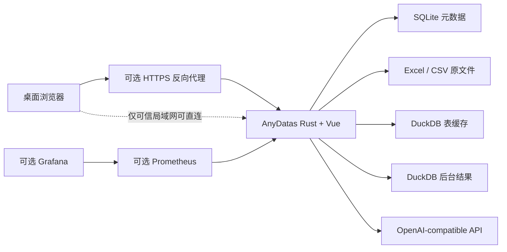

# 11 单机部署与运维方案

更新日期: 2026-07-26

## 1. 结论

当前 AnyDatas MVP 面向单台 Linux 服务器，默认只运行一个应用容器和一个持久化数据卷。Rust 进程同时承担 API、Vue 静态资源、SQLite 元数据、后台任务 Worker、计划任务 Worker 和存储维护 Worker；DuckDB 在进程内执行查询。

当前版本不依赖 Kubernetes、Redis、Temporal、MinIO、外部数据库或 Docker Socket。Kubernetes Jobs 仍是多节点与强隔离阶段的可选执行后端，不是单机部署前置条件。

## 2. 当前拓扑



基础 Compose 只有 `anydatas` 服务。SQLite、上传文件、表缓存、后台完整结果和 `.secret-key` 都位于 `anydatas-data` 命名卷；Prometheus 与 Grafana 通过独立覆盖文件启用，不影响主应用运行。

## 3. 服务器规格

| 场景 | CPU | 内存 | 数据盘 | 建议并发 |
| --- | --- | --- | --- | --- |
| 开发或演示 | 4 核 | 8 GB | 100 GB SSD | 查询 1，解析 1 |
| 小团队试点 | 8 核 | 16 GB | 500 GB SSD | 查询 2，解析 1 |
| 单机生产 | 16 核 | 32-64 GB | 1 TB NVMe | 查询 2-4，解析 1-2 |

Excel 解压、类型推断和 DuckDB 聚合都可能同时消耗内存。不要直接把并发数设置为 CPU 核数；先按真实文件测量峰值 RSS、临时盘和查询等待时间，再逐步提高。

## 4. 首次部署

```bash
cp .env.example .env
docker compose config --quiet
docker compose up --build -d
curl --fail http://127.0.0.1:28080/api/readyz
```

默认只绑定 `127.0.0.1:28080`。需要从局域网访问时，把 `.env` 的 `ANYDATAS_HOST_BIND` 设置为服务器的明确 LAN 或 Tailscale 地址，例如 `192.168.8.108`，不要无条件绑定所有网卡。

首次打开页面会创建 Owner、密码和默认工作区。密码使用 Argon2；浏览器 Cookie 为 `HttpOnly`、`SameSite=Lax`，数据库只保存会话令牌摘要。HTTPS 反向代理部署必须设置:

```dotenv
ANYDATAS_COOKIE_SECURE=1
```

## 5. 查询资源治理

单机默认配置:

```dotenv
ANYDATAS_QUERY_MAX_CONCURRENCY=2
ANYDATAS_FILE_PARSE_MAX_CONCURRENCY=1
ANYDATAS_RESOURCE_QUEUE_TIMEOUT_SECONDS=30
ANYDATAS_QUERY_TIMEOUT_SECONDS=120
ANYDATAS_BACKGROUND_QUERY_TIMEOUT_SECONDS=3600
ANYDATAS_FILE_PARSE_TIMEOUT_SECONDS=1800
ANYDATAS_DUCKDB_MEMORY_LIMIT_MB=1024
ANYDATAS_DUCKDB_THREADS=4
ANYDATAS_DUCKDB_TEMP_LIMIT_MB=10240
ANYDATAS_MIN_FREE_SPACE_MB=1024
ANYDATAS_JOB_RESULT_MAX_MB=20480
ANYDATAS_JOB_RESULT_RETENTION_DAYS=30
```

查询和文件解析使用独立信号量，等待超时会明确返回繁忙错误。DuckDB 每次连接都设置线程、内存、临时目录和临时空间上限；交互查询与后台查询使用不同超时。上传、缓存和完整结果写入前都会检查数据卷剩余空间。

源文件没有固定行数硬上限。容量边界来自单机 CPU、内存、磁盘和管理员配置，不通过静默截断数据实现。交互接口只返回有界结果页；后台任务把完整结果写入独立 DuckDB 产物，SQLite 只保留元数据和最多 200 行样本。

## 6. 存储生命周期

| 路径 | 内容 | 生命周期 |
| --- | --- | --- |
| `/data/anydatas.db` | 用户、工作区、配置和任务元数据 | 持久 |
| `/data/uploads/` | 已确认导入的原始文件 | 随数据源 |
| `/data/staging/` | 导入预检文件 | 24 小时或取消 |
| `/data/table-cache/` | 可重建 DuckDB 表缓存 | 配置版本和引用驱动 |
| `/data/query-work/` | 查询临时库 | 单次查询，启动时清理 |
| `/data/job-results/` | 后台任务完整结果 | 默认 30 天 |
| `/data/.secret-key` | AI API Key 本地加密主密钥 | 持久且必须备份 |

服务启动前会清理中断查询、临时文件、孤立缓存、过期暂存导入和孤立结果。每小时维护 Worker 清理到期后台结果，但保留任务 SQL、状态、耗时和日志。

手工预览或提前应用结果保留策略:

```bash
python3 scripts/retention.py --data-dir var-rust --keep-days 30
python3 scripts/retention.py --data-dir var-rust --keep-days 30 --force
```

Docker 部署通常不需要额外运行该脚本，内置维护 Worker 会根据 `ANYDATAS_JOB_RESULT_RETENTION_DAYS` 自动执行。

## 7. 一致性备份

使用只读运维容器在线备份，不需要停止主服务:

```bash
docker compose -f docker-compose.yml -f docker-compose.operations.yml \
  --profile tools run --rm backup
```

备份流程:

1. 使用 SQLite Online Backup API 创建一致性快照。
2. 从快照删除未完成的 `staged_imports`。
3. 把表缓存状态重置为待构建，不复制可重建缓存。
4. 只复制快照引用的上传文件和后台结果。
5. 保存 `.secret-key`；存在加密 AI 配置但密钥缺失时直接失败。
6. 为归档生成内部逐文件 SHA-256 清单和外部归档 SHA-256。

备份默认写入宿主机 `./backups`，必须位于数据卷之外。生产环境应把 `ANYDATAS_BACKUP_DIR` 指向独立磁盘或随后同步到异机对象存储，并定期做恢复演练。

## 8. 恢复

恢复必须停服:

```bash
docker compose stop anydatas
ANYDATAS_RESTORE_ARCHIVE=anydatas-backup-20260726T000000Z.tar.gz \
  docker compose -f docker-compose.yml -f docker-compose.operations.yml \
  --profile tools run --rm restore
docker compose up -d anydatas
curl --fail http://127.0.0.1:28080/api/readyz
```

恢复会先验证外部摘要、内部文件清单、归档路径和 SQLite `quick_check`。Docker 卷模式保留挂载点，在同一卷内暂存旧内容；只有新载荷全部安装并修正为 UID/GID `10001` 后才删除回滚副本。失败时旧内容会移回原位。

恢复完成后至少检查:

1. Owner 可登录和退出。
2. 原文件、逻辑表、保存查询、任务和计划存在。
3. 保存的 AI Key 仍可连接。
4. 一张历史表能重建缓存并查询。
5. 一个带完整结果的后台任务可分页查看并下载 CSV。

## 9. 健康与监控

- `GET /api/livez`: 只确认进程事件循环可响应，供容器判断是否需要重启。
- `GET /api/readyz`: 检查 SQLite、数据卷读写和最低剩余空间。
- `GET /api/health`: 兼容入口，语义与 `readyz` 相同。
- `GET /api/metrics`: 需要独立 Bearer Token，输出低基数 Prometheus 指标。

指标覆盖请求量、5xx、查询/解析槽位、任务与 Agent 状态、Worker 心跳、数据源行数和存储使用。指标不包含用户、工作区、文件名、SQL 或结果内容。

启用监控:

```bash
cp monitoring/metrics-token.example monitoring/metrics-token
chmod 600 monitoring/metrics-token
export ANYDATAS_GRAFANA_ADMIN_PASSWORD='replace-with-a-long-random-password'
docker compose -f docker-compose.yml -f docker-compose.monitoring.yml up -d
```

Prometheus 和 Grafana 默认仅绑定 `127.0.0.1`。远程运维使用 SSH Tunnel、Tailscale 或受认证反向代理，不直接开放公网端口。

## 10. AI 网络边界

工作区管理员可以配置 OpenAI Chat Completions-compatible 地址，但不能自行扩大服务器网络权限。默认拒绝 localhost、`.local`、私网、链路本地、云元数据、保留网段和重定向；公网地址必须使用 HTTPS。

只有部署者明确需要连接同机 Ollama 或局域网模型服务时才设置:

```dotenv
ANYDATAS_AI_ALLOW_PRIVATE_NETWORK=1
```

开启后应通过主机防火墙限制 AnyDatas 可访问的私网地址，不要把该开关当成通用出网许可。

## 11. 升级与回退

升级前先生成备份，然后构建目标版本:

```bash
docker compose -f docker-compose.yml -f docker-compose.operations.yml \
  --profile tools run --rm backup
docker compose build anydatas
docker compose up -d anydatas
curl --fail http://127.0.0.1:28080/api/readyz
```

数据库迁移由 SQLx 在启动时按顺序执行。当前迁移只向前；若新版本已经写入不兼容数据，回退镜像前必须按第 8 节恢复升级前备份。不要在服务运行时覆盖 SQLite 或数据卷文件。

## 12. 何时考虑 Kubernetes

只有出现以下条件之一，才值得把执行层迁移到 Kubernetes Jobs 或独立 Worker 集群:

- 单机 CPU、内存或磁盘无法满足峰值负载。
- 需要多个应用实例和自动故障转移。
- 需要把不可信 Python/Rust 用户代码放入强隔离沙箱。
- 多租户要求节点池、网络策略、资源配额和审计边界。
- 后台任务必须跨节点重试、抢占或弹性扩缩容。

迁移时应保留 API、任务模型和结果产物协议，替换执行适配器，而不是把当前单机产品整体重写。对于现阶段“上传 Excel/CSV 并用 SQL 分析”的主路径，单机 DuckDB 架构仍是更低运维成本的选择。
