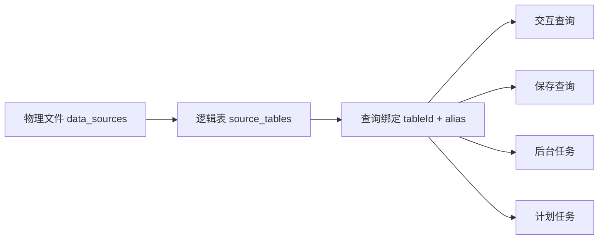

# 15 跨文件与跨 Sheet 分析实现

更新日期: 2026-07-18

## 1. 实施结论

跨文件、跨 Sheet 查询已经完成，不再停留在规划阶段。当前 Rust/Vue 版本支持:

- 上传一个 Excel 后，为每个 Sheet 自动创建独立逻辑表。
- 在同一 Sheet 上创建多个不同单元格范围的逻辑表。
- 在一次查询中绑定不同文件、不同 Sheet 或同一逻辑表的多个别名。
- 使用 DuckDB SQL 执行 `JOIN`、CTE、聚合、窗口函数和计算字段。
- 保存 SQL 时同时保存有序表绑定和别名。
- 后台任务、重试、计划任务和立即运行使用相同的多表绑定快照。
- 首次查询生成单表 DuckDB 缓存，后续查询不再重复解析 Excel/CSV。

该能力保持单机部署，不引入 Kubernetes、Redis、外部 Worker 或 Docker socket。

## 2. 三层数据模型



### 物理文件

`data_sources` 保存上传文件、格式、大小、工作区和可用 Sheet 列表。上传文件写入后视为不可变对象；改变读取方式不会覆盖原文件。

### 逻辑表

`source_tables` 表示物理文件中的一个可查询范围，主要字段包括:

| 字段 | 含义 |
| --- | --- |
| `source_id` | 所属物理文件 |
| `sheet_name` | Excel Sheet；CSV 固定为“数据” |
| `start_cell` / `end_cell` | 起止单元格，结束单元格可为空 |
| `first_row_as_header` | 是否把范围首行作为字段名 |
| `schema_json` | 字段名称、推断类型和空值信息 |
| `config_version` | 配置版本，变更后使旧缓存失效 |
| `cache_key` / `cache_status` | 单表缓存身份和状态 |
| `is_default` | 文件的兼容默认表，每个文件唯一 |

同一个 Sheet 可以创建多个逻辑表，因此页首说明、多个数据块或不同表头位置不需要复制原文件。

### 查询绑定

查询上下文是有序数组:

```json
[
  { "tableId": "orders-table-id", "alias": "orders" },
  { "tableId": "customers-table-id", "alias": "customers" }
]
```

同一 `tableId` 可以出现多次，只要别名不同，即可执行自连接。别名必须匹配 `[A-Za-z_][A-Za-z0-9_]{0,62}`，大小写不敏感地唯一，并禁止系统保留名称。

## 3. 数据库迁移

`backend/migrations/0003_multi_table_queries.sql` 新增:

- `source_tables`
- `saved_query_tables`
- `job_tables`
- `schedule_tables`

升级时会为每个历史 `data_sources` 记录创建一个默认逻辑表，并为历史保存查询、任务和计划回填 `{ alias: "data" }`。原有 `source_id` 字段继续作为兼容主文件和级联关系保留，因此迁移不要求用户重建已有查询。

新上传文件会在同一 SQLite 事务中写入物理文件记录和全部 Sheet 逻辑表。任一步失败都会回滚数据库并清理上传文件。

## 4. 查询 API

`POST /api/query` 请求示例:

```json
{
  "sourceId": "compat-primary-source-id",
  "tables": [
    { "tableId": "orders-table-id", "alias": "orders" },
    { "tableId": "customers-table-id", "alias": "customers" }
  ],
  "sql": "SELECT c.name, SUM(o.amount) AS total FROM orders o JOIN customers c ON c.id = o.customer_id GROUP BY c.name",
  "limit": 1000
}
```

旧客户端只发送 `sourceId` 时，服务端自动绑定该文件默认逻辑表为 `data`。新客户端始终发送 `tables`。

逻辑表接口:

| API | 用途 |
| --- | --- |
| `GET /api/source-tables` | 列出工作区全部逻辑表，可按 `sourceId` 筛选 |
| `GET /api/source-tables/{id}` | 获取一个逻辑表 |
| `POST /api/data-sources/{id}/tables` | 在文件上创建额外范围 |
| `PATCH /api/source-tables/{id}` | 修改名称、Sheet、范围和表头设置 |
| `GET /api/source-tables/{id}/preview` | 按逻辑表配置预览 |
| `DELETE /api/source-tables/{id}` | 删除非默认逻辑表 |

单次查询最多绑定 16 张逻辑表，返回前端的结果最多 5000 行。源数据本身没有行数上限；上传文件大小仍由 `ANYDATAS_MAX_UPLOAD_BYTES` 控制。

## 5. 单表缓存

缓存目录为持久卷中的 `table-cache/`。缓存键由逻辑表 ID、配置版本、Sheet、起止单元格和表头设置计算 SHA-256 得到。

缓存构建过程:

1. 读取最多 2000 行推断字段类型。
2. 在临时 DuckDB 文件中创建 `cached_data` 表。
3. CSV/Excel 行流式追加，并在后台任务中每 1024 行检查取消状态。
4. 执行 `CHECKPOINT`、关闭连接，再原子改名为最终缓存文件。
5. 查询临时库以只读方式 `ATTACH` 所需缓存，并为用户别名创建临时视图。
6. 完成挂载后关闭 DuckDB 外部访问和扩展自动加载，再执行用户 SQL。

同一缓存被多个别名引用时只挂载一次。配置更新会增加 `config_version` 并生成新缓存键，不会让进行中的查询读到被覆盖的数据。

当前使用进程级互斥锁串行化缓存构建，适合单机 MVP，也避免多个请求同时导入同一大文件。已有缓存的查询不持有该锁。

## 6. 前端交互

桌面工作台采用固定三栏:

- 左栏: 文件树，可展开查看全部 Sheet/逻辑表；`+` 将表加入查询，再次添加可用于自连接。
- 中栏查询 Tab: 表绑定栏、Monaco SQL 编辑器和表格/图表结果。
- 中栏预览 Tab: 预览右侧当前逻辑表的读取范围。
- 右栏: 物理文件信息、逻辑表名称、Sheet、起止单元格、表头、缓存状态和字段。

绑定栏支持改名、移除和切换检查对象。Monaco 根据当前绑定动态补全别名和字段。保存查询、转为后台任务以及任务/计划表单都携带完整绑定数组。

本阶段只验收桌面端，未加入移动端压缩布局。

## 7. 安全与一致性

- 所有逻辑表查询都通过物理文件的 `workspace_id` 校验归属。
- 前台查询和保存/任务/计划创建要求 Analyst 及以上角色。
- 用户 SQL 只允许单条 `SELECT` 或 `WITH`。
- 禁止 `ATTACH`、`COPY`、DDL、DML、扩展加载以及文件读取函数。
- 缓存路径和服务器文件路径从不返回前端。
- 保存查询、任务和计划的主体记录与绑定关系在同一 SQLite 事务中提交。
- 后台任务取消会设置取消标记并中断活动 DuckDB 连接；缓存导入阶段也会轮询取消。

## 8. 已完成验证

自动测试:

```bash
python3 scripts/with-duckdb-prebuilt.py -- cargo test --manifest-path backend/Cargo.toml --locked
python3 scripts/with-duckdb-prebuilt.py -- cargo clippy --manifest-path backend/Cargo.toml --locked --all-targets -- -D warnings
pnpm --dir frontend run build
```

Rust 测试覆盖跨两个 CSV 的 JOIN、同表双别名自连接、范围裁剪、只读 SQL、具体编译错误，以及 200001 行以上查询。

真实端到端验证使用两份各 500000 行、6 字段的 CSV:

- 两个独立物理文件和逻辑表均成功创建。
- 跨文件聚合 JOIN 返回 2 行正确结果。
- 缓存命中后的服务端查询耗时为 27–28 ms。
- 工作台 UI 查询分别返回 `left_total=500000`、`right_total=500000`。
- 保存查询完整回读两张表和别名。
- 多表后台任务成功，结果为 2 行；高基数任务可真实取消。
- 禁用状态计划成功保存两张表绑定。
- Chromium 1440x900 检查无重叠，控制台 0 错误、0 警告。

## 9. 当前限制与后续

当前明确限制:

- 缓存构建进度尚未在前台显示百分比。
- 配置更新产生的旧缓存尚未自动回收，需要后续缓存 GC。
- Calamine 读取大型 Excel 时仍受单进程内存约束；CSV 已按行流式导入。
- 暂无可视化 JOIN 画布，关联关系由 SQL 表达。
- 查询上下文是页面状态，尚未作为独立“分析项目”自动保存。

建议下一阶段顺序:

1. 增加缓存大小、最后使用时间和后台 GC。
2. 增加异步缓存构建状态与进度，不阻塞首次交互请求。
3. 将超大 Excel 首次导入转换为 Parquet 或 DuckDB，展示预估内存和耗时。
4. 增加分析项目实体，自动保存 SQL、绑定、参数和图表配置。
5. 在 SQL 工作流稳定后再增加可视化关联编辑器和持久报表。
