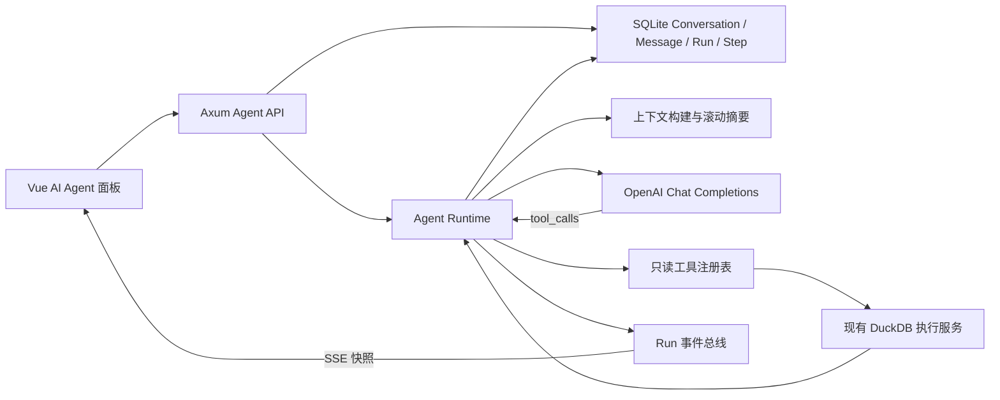
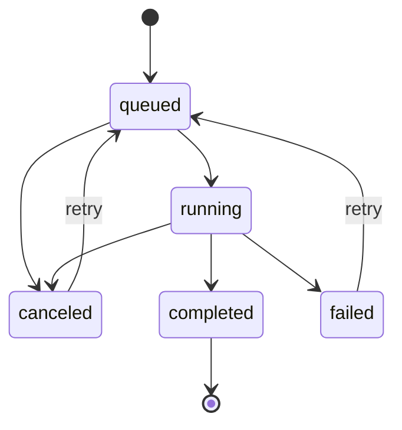

# AI Agent Runtime 架构与实现

更新日期: 2026-07-26

## 1. 目标

AnyDatas 的 AI 不再是“把全部聊天历史发给一次 Chat 请求”的包装层，而是一套由服务端负责状态、工具和恢复的 Agent Runtime。它解决以下问题:

1. 长对话由服务端持久化并自动压缩，浏览器只提交本轮增量。
2. 模型使用 OpenAI Chat Completions 原生 `tools` / `tool_calls`，不解析自定义 XML 标签。
3. SQL 预览和表样本读取是受控只读工具，复用正式 DuckDB 查询安全边界。
4. 每次执行都有独立 Run 和 Step，可实时订阅、停止、重试、刷新恢复和审计。
5. 模型回复不设置业务字符上限；只保留单个异常 SSE 事件 8 MB 的协议防护。

单轮 `/api/ai/chat` 和 `/api/ai/sql` 已移除，模型调用统一经过 `/api/ai/agent/*` 与同一个 Provider。

## 2. 总体结构



单服务器部署仍只有一个 Rust 进程、一个 SQLite 数据库和现有数据卷，不需要 Redis、Kubernetes 或独立 Worker。Agent 使用 Tokio 后台任务运行；进程内事件总线只传递 Run 版本通知，完整状态始终在 SQLite。服务重启时无法续跑的 Run 会被统一标记为 `failed/server_restart`，不会永久停在 `running`。

## 3. 持久化模型

迁移 `0006_ai_agent_runtime.sql` 新增四张表:

| 表 | 职责 | 关键约束 |
| --- | --- | --- |
| `ai_conversations` | 用户会话、表绑定快照、上下文签名、滚动摘要 | 工作区和用户双重归属 |
| `ai_messages` | 用户/助手消息、候选 SQL、工具结果 | 线性 sequence；旧分支标记 `superseded` |
| `ai_runs` | 一次 Agent 生命周期 | 每个会话最多一个 queued/running Run |
| `ai_run_steps` | 每次模型决策和工具执行 | 按 ordinal 保存状态、输入、输出和错误 |

会话表绑定签名包含有序 `tableId`、别名和逻辑表 `config_version`。字段类型、读取范围或表绑定变化后，旧会话不能静默继续执行；用户必须选择新建会话或显式切换上下文。

## 4. Run 状态机



运行流程:

1. API 校验身份、表绑定、上下文签名和消息长度。
2. 在一个事务中写入用户消息与 `queued` Run，然后返回 HTTP 202。
3. 后台 Runtime 将 Run 切换为 `running`，构建上下文并进入 Plan/Act/Observe 循环。
4. 每次模型调用和工具执行先写 `running` Step，完成后再写结构化结果。
5. 最后一轮不再声明工具，强制模型在步骤预算内收敛为最终回复。
6. 助手消息和 `completed` 状态在同一事务写入，避免只保存其中一半。

停止 Run 会设置进程内取消令牌、更新 SQLite 状态，并调用 DuckDB `InterruptHandle` 中断当前工具查询。失败或取消的最近 Run 可原位重试，复用原用户消息，不制造“请重试”之类的伪业务历史。

## 5. 原生模型协议

模型请求使用标准 Chat Completions 字段:

```json
{
  "model": "configured-model",
  "messages": [
    { "role": "system", "content": "..." },
    { "role": "user", "content": "..." }
  ],
  "stream": true,
  "tools": [
    { "type": "function", "function": { "name": "preview_sql", "parameters": {} } }
  ],
  "tool_choice": "auto",
  "parallel_tool_calls": false
}
```

SSE 解析器按 `choices[].delta.tool_calls[index]` 拼接 call id、函数名和分段 JSON 参数，再通过带 `tool_call_id` 的 `role=tool` 消息回填观察结果。兼容服务若返回非流式 JSON，仍读取 `choices[0].message.tool_calls`。

模型文字回复没有累计字符上限。解析器消费完一行 SSE 后立即释放协议字节，只在单个事件连续超过 8 MB 且没有换行时停止，以防损坏上游无限占用内存。

## 6. 工具注册表

### 6.1 `preview_sql`

- 参数: `{ "sql": "SELECT ...", "stepTitle": "...", "reasoningSummary": "..." }`
- 仅接受一条 `SELECT` 或 `WITH`。
- 复用查询引擎对写操作、外部文件、网络、扩展加载和危险函数的拒绝策略。
- 查询执行上限 20 行，回给模型和浏览器的观察最多 10 列、5 行。

### 6.2 `inspect_table`

- 参数: `{ "alias": "data", "limit": 5, "stepTitle": "...", "reasoningSummary": "..." }`
- 别名必须存在于当前服务端绑定，不能由模型任意指定文件或路径。
- Runtime 生成带安全标识符转义的 `SELECT * FROM "alias" LIMIT n`。
- `limit` 被限制在 1 到 20。

未知工具和无效参数不会动态调用任何代码。它们被记录为失败 Step，并作为工具观察返回模型，使模型有机会在后续步骤自行修正。

## 7. 上下文与长对话

每轮上下文由服务端构建:

- 当前工作区名称。
- 每张逻辑表的别名、文件/Sheet/范围标签、行数、配置版本和字段定义。
- 当前编辑器 SQL。
- 用户选择附带的小型查询结果样本。
- 服务端滚动摘要与近期活跃分支消息。

不会发送原始文件、整张表、服务器文件路径、DuckDB 缓存键或全部查询结果。前端样本和工具结果都会再次在后端裁剪，复杂 JSON 值会转成短文本。

当历史超过预算时，Runtime 用确定性规则将最早消息压成摘要。固定规则、工作区事实、摘要和近期消息分别占用明确额度，最终文本严格不超过 `ANYDATAS_AGENT_CONTEXT_CHARS`，并优先保留最新用户需求。摘要不调用模型，避免额外费用、递归超时和事实改写。重新生成旧回复时，旧分支消息标记为 `superseded`，摘要边界重置并按新活跃分支重建。

## 8. API

| 方法 | 路径 | 用途 |
| --- | --- | --- |
| GET | `/api/ai/agent/conversations` | 列出当前用户会话 |
| POST | `/api/ai/agent/conversations` | 创建会话和表绑定快照 |
| GET | `/api/ai/agent/conversations/{id}` | 获取消息和最近 Run |
| DELETE | `/api/ai/agent/conversations/{id}` | 归档会话 |
| PUT | `/api/ai/agent/conversations/{id}/context` | 显式切换表上下文 |
| POST | `/api/ai/agent/conversations/{id}/runs` | 创建异步 Run |
| POST | `/api/ai/agent/conversations/{id}/regenerate` | 从助手消息处分叉重生成 |
| GET | `/api/ai/agent/runs/{id}` | 获取 Run 和 Steps |
| GET | `/api/ai/agent/runs/{id}/events` | 订阅事件驱动的 Run 快照 |
| POST | `/api/ai/agent/runs/{id}/cancel` | 停止 Run |
| POST | `/api/ai/agent/runs/{id}/retry` | 原位重试失败/取消 Run |

全部接口要求 Analyst 以上角色，并在数据库查询中同时校验 `workspace_id` 和 `user_id`。工作区 AI 配置仍只有 Owner/Admin 可以修改或测试。

## 9. 运维参数

| 环境变量 | 默认值 | 允许范围 | 说明 |
| --- | --- | --- | --- |
| `ANYDATAS_AGENT_MAX_STEPS` | `6` | 2-20 | 单 Run 最大模型决策轮数；最后一轮强制收敛 |
| `ANYDATAS_AGENT_TIMEOUT_SECONDS` | `300` | 30-1800 | 单 Run 总超时，同时作为单次上游请求上限 |
| `ANYDATAS_AGENT_CONTEXT_CHARS` | `80000` | 20000-500000 | 系统、Schema、摘要和近期消息总字符预算 |

部署升级时 SQLx 自动运行迁移。启动恢复会关闭重启前遗留的 `queued/running` Run 和 `running` Step。SQLite 仍应使用 Online Backup API 备份，并同时保存 `/data/.secret-key`、上传文件和缓存。

## 10. 前端行为

右侧面板不再读写 AI `localStorage`:

- 历史按钮展示服务端会话和最近 Run 状态。
- 页面刷新会打开最近会话，并继续订阅未结束 Run。
- 运行轨迹展示真实模型/工具 Step，不展示隐藏推理或模拟状态。
- 停止、失败重试、回复重新生成、归档和上下文切换都调用服务端 API。
- 候选 SQL 仍提供复制、应用、预览、应用并运行；正式结果保持由中央查询区管理。

## 11. 当前边界

- 运行中服务进程重启会把 Run 标记为失败，不做跨进程断点续跑。
- 正常路径使用 SSE；浏览器或代理不支持事件流时才以 700ms 短轮询降级。
- 工具注册表只有 SQL 预览和表样本读取，后续可增加字段统计、查询解释和保存报表，但必须继续走显式注册和权限校验。
- 仍使用 Chat Completions 兼容协议；Responses API 和厂商私有 Agent 协议未接入。
