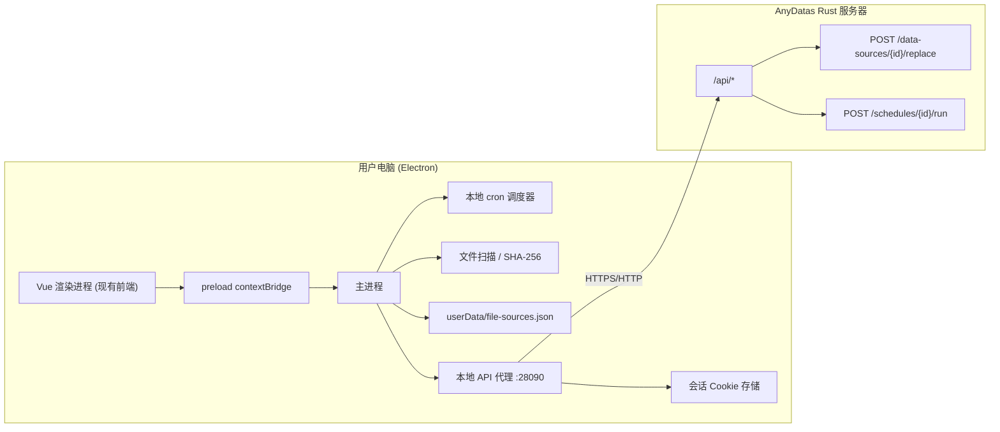

# 18 Electron 本地采集 Agent（文件源）

更新日期: 2026-08-09

## 1. 目标与结论

AnyDatas 现有数据来源只有浏览器手动上传，定时任务只能对已存在的数据源跑 SQL。本方案为桌面端增加**本地文件采集 Agent**：文件在用户自己的电脑上，由 Electron 桌面客户端读取本地文件、自动上传并**覆盖更新**服务器上的数据源，然后触发指定的查询调度，形成"本地文件 → 新数据 → 定时分析"的完整自动化闭环。

决策（用户确认）:

1. **形态**: 完整桌面版 Electron——现有 Vue 前端打包进 Electron 窗口，全部功能可用，另加"文件采集"页管理本地自动化。
2. **平台**: 先开发模式验证（`electron .` 直跑），不先做安装包。
3. **更新语义**: 同名/新文件**覆盖更新同一数据源**（保持 `source_id` 不变，下游绑定自动指向新数据）。
4. **触发**: 采集成功后触发配置的查询 schedule（依次调用 run-now），保证分析基于新数据。

服务器端无需"文件源"表或调度——文件在用户本地，只有本地进程能感知文件变化。服务器只新增一个 API: 覆盖更新数据源。文件源的 cron、扫描、哈希比较全部在 Electron 主进程完成。

## 2. 总体结构



采集流程（主进程）:

1. cron 到期 → 对每个启用的文件源执行采集。
2. 扫描配置目录，按文件名模式匹配并取修改时间最新的文件；MVP 支持 `*`、`?`，不支持目录分隔符和递归 `**`。
3. 计算 SHA-256，与上次成功采集的 hash 相同则跳过（文件没变不重复导入）。
4. 读取文件内容 → 通过本地代理 multipart 上传 `POST /api/data-sources/{id}/replace`。
5. 替换成功后依次调用配置的下游 schedule `POST /api/schedules/{id}/run`；全部成功后记录 hash/时间/行数。
6. 失败记录错误；下一次 cron 或手动运行会重试。若数据替换已经成功、只有下游 schedule 失败，相同文件的下一次运行只重试 schedule，不重复上传替换。

## 3. 文件源模型（本地 JSON，非服务器表）

`userData/file-sources.json`:

```json
{
  "id": "uuid",
  "name": "日报数据",
  "directory": "/Users/blank/Desktop/export",
  "pattern": "daily_*.xlsx",
  "targetSourceId": "服务器数据源 id",
  "cron": "0 8 * * *",
  "timezone": "Asia/Shanghai",
  "enabled": true,
  "triggerScheduleIds": ["schedule-id-1"],
  "lastRun": {
    "status": "success" | "skipped" | "failed",
    "at": "2026-08-08T08:00:01Z",
    "file": "daily_20260808.xlsx",
    "fileHash": "sha256...",
    "rowsImported": 1234,
    "error": null
  },
  "createdAt": "...", "updatedAt": "..."
}
```

- 每个文件源绑定一个服务器数据源（下拉选择），文件内容按**该数据源现有逻辑表配置**（sheet/range/表头/字段类型）重新解析。
- 运行历史保留最近 20 条（`runs` 数组），界面展示。

## 4. 服务器端改动（backend）

### 4.1 新增 `POST /api/data-sources/{id}/replace`

multipart 请求，字段:

| 字段 | 必填 | 说明 |
| --- | --- | --- |
| `file` | 是 | 新文件（.xlsx/.xls/.xlsb/.ods/.csv），受 `ANYDATAS_MAX_UPLOAD_BYTES` 限制 |
| `tables` | 否 | 当前不支持；请求包含该字段时返回 400。替换固定复用该数据源现有 `source_tables` 配置 |

行为:

1. `require_analyst()` 校验；校验数据源属于当前工作区。
2. 复用 `store_multipart_file` 存入 staging；扩展名校验复用 `file_metadata`。
3. `run_file_task` 内解析新文件；对每个逻辑表调用现有 `inspect_import_table`（sheet/range/表头），字段类型沿用现有 `schema_json`（`apply_field_overrides` 语义：**字段数量或名称变化时报错回滚**，因为下游 SQL 引用旧字段）。
4. 提交前先把旧文件显式改名为同目录临时备份，再把新文件移入 `uploads/{source_id}.{ext}`。
5. 数据库事务内:
   - 更新 `data_sources`: `original_filename`、`size_bytes`、`sheet_names_json`、`row_count`、`column_count`、`selected_sheet`、`start_cell`、`first_row_as_header`、`updated_at`。
   - 更新每条 `source_tables`: `row_count`、`column_count`、`schema_json`、`config_version = config_version + 1`、`cache_status = 'pending'`、`updated_at`。**`config_version` 是 DuckDB 缓存键的一部分，递增即自动失效重建**，无需额外清理。
6. 新文件安装失败或数据库事务失败时删除新文件并恢复备份；提交成功后删除备份，并尽力清理已无引用的旧缓存。返回保持原 `source_id` 的 `DataSource`。

安全: 服务器不信任客户端路径——replace 只接受上传内容，路径由服务器管理；API 权限与普通上传一致（analyst 以上）。

### 4.2 测试

- 成功替换：行数/列数/字段更新，`config_version` 递增，缓存状态变 `pending`。
- 结构变化回滚：新文件列数不同 → 400，旧文件保留，数据源元数据不变。
- 权限：非本工作区 / 未登录 → 403/401。

## 5. 前端改动（frontend）

1. `src/api.ts`: axios `baseURL` 支持 `window.__ANYDATAS_API_BASE__`（Electron preload 注入本地代理地址 `http://127.0.0.1:28090`），缺省 `/api` 保持网页行为不变；`replaceSource(id, file)` 保留网页调用能力，桌面采集实际由主进程 `LocalApiClient` 直接流式上传本地路径。
2. 新增 `src/views/FileSourcesView.vue` + 路由 `/file-sources`（`meta.requiresAuth`）：
   - 列表：名称、目录、模式、cron、目标数据源、上次运行状态/时间、启用开关、立即运行。
   - 新建/编辑：目录选择（Electron dialog）、模式、cron、时区、目标数据源下拉（`listSources`）、下游 schedule 多选（`listSchedules`）。
   - 运行历史（最近 20 条）与错误展示。
3. `AppShell.vue` 导航：仅当 `window.desktop` 存在（Electron 环境）时显示"文件采集"入口；网页端不出现。

## 6. Electron 壳（新 desktop/ 目录）

```
desktop/
  package.json          # Electron 依赖与 test/typecheck/build/dev 脚本
  src/main.ts           # 窗口、API 代理、调度器、采集流程、IPC
  src/preload.ts        # contextBridge 暴露 window.desktop
  scripts/check-production-renderer.mjs # 真实 file:// 生产渲染 smoke
```

- **窗口**: 生产通过 `loadFile` 加载 `frontend/dist/index.html`，Vite 使用相对资源基址，Vue Router 在 `file:` 下使用 hash history；HTTP(S) 网页部署仍使用 HTML5 history。开发模式加载 `http://127.0.0.1:5173`。
- **API 代理**: 主进程固定监听 `127.0.0.1:28090`，把 `/api/*` 转发到用户选择的单机子进程或远端服务器。未选择模式时返回受控 503；切换服务器会清空 Cookie。只接受生产 `file://`/`null` origin 或开发态 `127.0.0.1:5173`/`localhost:5173`，并在本地补齐 CORS 响应。**会话 Cookie 由主进程内存 jar 持有**（登录响应 `Set-Cookie` 不暴露给渲染进程，后续上游请求自动带回）；Electron 重启后需重新登录。双模式与发行协议见 [19 桌面双模式与服务端运行时](19-desktop-runtime-modes.md)。
- **cron**: 不引第三方依赖，移植 5 字段 cron 解析（分钟/时/日/月/周）；主进程每 30 秒检查一次，并按文件源记录已执行的 UTC 分钟，保证同一分钟至多触发一次。
- **IPC**（`window.desktop`）:
  - `listFileSources()` / `createFileSource(config)` / `updateFileSource(id, config)` / `deleteFileSource(id)` / `toggleFileSource(id, enabled)`
  - `runFileSourceNow(id)`（手动立即采集）
  - `pickDirectory()`（系统目录选择对话框）
  - `onFileSourceEvent(callback)`（采集状态推送，界面实时刷新）
- **开发模式验证**: 本地后端使用 `pnpm --dir desktop dev`；连接其他明确授权的 HTTP(S) 目标时再设置 `ANYDATAS_API_TARGET=https://example.invalid`。

## 7. 验收清单

1. 网页端手动上传 → 建文件源绑定该数据源 → Electron 端"立即运行"→ 服务器该数据源被新文件替换，行数/字段更新，查询结果对应新数据。
2. 配置 cron + 触发 schedule → 到点自动采集 → 替换 → 目标 schedule 自动运行，任务历史出现新记录。
3. 同名未变化文件 → 跳过（`skipped`），不重复导入。
4. 结构变化（列数不同）→ 失败并显示错误，旧数据不受影响。
5. 网页端不显示"文件采集"入口；Electron 端完整桌面功能可用。
6. `cargo test`、Desktop Vitest/typecheck、Frontend/Desktop build 及生产 renderer smoke 通过。

## 8. 2026-08-09 隔离验收证据

本轮在临时数据目录和独立 Electron profile 中启动本地后端 `127.0.0.1:18081`，桌面代理仍为 `127.0.0.1:28090`。网络记录只出现 loopback 请求，未访问任何局域网服务。

1. 真实 Electron 生产 renderer 通过 `file://` 完成初始化、登录、文件源创建与管理；控制台 0 error。未打包 Electron 仍报告开发期 `Insecure Content-Security-Policy` warning，安装包阶段需配置严格 CSP。
2. 首次采集导入 2 行并触发选定 schedule；服务器数据源 ID 和逻辑表 ID 均保持不变，缓存完成重建。
3. 字节未变化的文件记录为 `skipped`，没有增加下游 job。
4. 新的兼容 CSV 导入 3 行，保持同一数据源/逻辑表 ID，并产生结果为 `row_count=3` 的下游 job。
5. 多一列的不兼容 CSV 返回 400（`字段数量已变化，请重新预检文件`）；数据库元数据、已安装文件、缓存版本和 job 数均保持不变，staging 与临时备份已清理。
6. `* * * * *` 的真实 cron tick 无需点击"立即运行"即可再次采集并创建成功 job。
7. 网页模式不显示"文件采集"，直接访问 `/file-sources` 会回到 `/workbench`。
8. 1440×900 与 1024×768 的列表、运行历史和编辑弹窗均无文档级横向溢出；生产渲染 smoke、71 个 Desktop 测试、Desktop typecheck、Frontend build 和 94 个 Backend 测试通过。

## 9. 后续演进（不在本次范围）

- electron-builder 打包（dmg/nsis）与自动更新。
- `fs.watch` 目录监听替代轮询扫描。
- 无头模式（托盘/CLI 运行采集，不启动窗口）。
- 多文件策略（全部匹配文件批量导入、按日期去重）。
