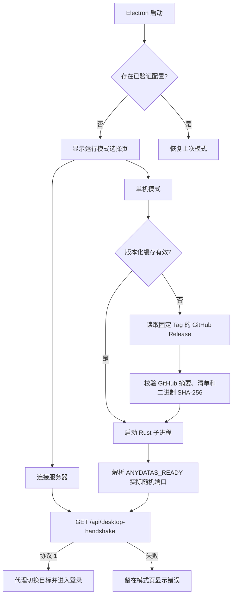

# 19 桌面双模式与服务端运行时

更新日期: 2026-08-09

## 1. 目标与边界

桌面端不把 Rust 服务端直接放进 Electron 安装包，而是在首次启动时让用户选择：

1. **单机模式**：从固定 GitHub Release 下载当前桌面版本锁定的原生服务端，校验后存入用户数据目录，并跟随 Electron 启停。
2. **连接服务器**：验证用户输入的 AnyDatas 根地址，保存地址；登录和后续业务请求都通过该服务器。

桌面前端始终访问主进程回环代理 `http://127.0.0.1:28090/api`。代理后面的目标可以切换，Vue、认证、文件采集和业务页面不需要维护两套调用逻辑。

## 2. 深模块与 Adapter

`BackendRuntimeManager` 是渲染层面对的运行时模块，interface 只有状态查询、配置、重置、停止和状态订阅。复杂性隐藏在两个 Adapter 后：

- `StandaloneBackendAdapter`：安装发行物、生成令牌、启动进程、解析就绪消息、握手、优雅停止。
- `RemoteBackendAdapter`：规范化地址并完成远端握手。

`ApiProxy.setTarget()` 是统一代理 seam。每次切换目标都会清空主进程 CookieJar；渲染进程无法读取服务端 Cookie或单机令牌。

## 3. 首次启动流程



只有握手成功的选择才会原子写入 `userData/backend-runtime.json`。失败地址不会覆盖上一次可用配置。

## 4. 服务端发行约定

服务端 Tag 必须与 `backend/Cargo.toml` 版本一致：`server-v<version>`。`.github/workflows/server-release.yml` 在 Tag 推送后分别构建：

- `anydatas-server-linux-x64`
- `anydatas-server-windows-x64.exe`
- `anydatas-server-macos-arm64`
- `anydatas-server-macos-x64`
- `anydatas-server-manifest.json`

清单格式：

```json
{
  "schemaVersion": 1,
  "serverVersion": "0.1.2",
  "protocolVersion": 1,
  "tag": "server-v0.1.2",
  "assets": {
    "linux-x64": {
      "name": "anydatas-server-linux-x64",
      "sha256": "64 位十六进制摘要",
      "size": 12345678
    }
  }
}
```

桌面端不请求 `latest`，默认固定 `server-v0.1.2`。Windows x64 服务端静态链接 MSVC Runtime，用户无需另装 VC++ Redistributable。后续桌面发布必须先验证新服务端，再显式更新锁定 Tag。

## 5. 单机进程安全与数据目录

单机服务端使用：

- `ANYDATAS_BIND=127.0.0.1:0`：操作系统分配随机回环端口。
- `ANYDATAS_DESKTOP_TOKEN`：每次启动生成 32 字节随机令牌，Electron 代理注入 `X-AnyDatas-Desktop-Token`。
- 桌面资源档位：DuckDB 512 MiB、2 线程、4 GiB 临时空间上限、256 MiB 最低剩余磁盘。
- `userData/standalone-data`：SQLite、上传、缓存、结果与本地密钥。
- `userData/server-runtime/<tag>/<platform>`：已验证、可离线复用的版本化二进制。
- `userData/logs/server.log`：本地服务端 stdout/stderr。

应用退出先等待 Rust 响应 `SIGTERM`，随后关闭代理并退出 Electron。若温和退出超过 5 秒才强制终止。

## 6. 远端地址规则

- 接受 `http://`、`https://`；没有协议时补 `http://`，方便局域网地址。
- 拒绝 URL 用户名/密码、查询参数、片段和非根路径。
- 非本机地址在界面提示使用 HTTPS。
- 登录前必须返回 `service=anydatas-server`、`protocolVersion=1`。
- 切换服务器后认证 Store 重置，必须向新服务器重新读取初始化/登录状态。

## 7. 仓库拆分

当前默认 Release 地址仍是 `Ling0925/AnyDatas`，但下载地址可通过环境覆盖：

- `ANYDATAS_SERVER_REPOSITORY=owner/AnyDatas-Server`
- `ANYDATAS_SERVER_RELEASE_TAG=server-v0.1.2`
- `ANYDATAS_SERVER_RELEASE_METADATA_URL=https://...`（完整覆盖）

因此可以先完成同仓库验证，再把 `backend/`、迁移与 Release 工作流迁到独立服务端仓库。桌面模块和清单协议不需要重写。

私有 GitHub Release 只支持开发期用 `ANYDATAS_GITHUB_TOKEN` 验证。面向最终用户时必须使用公开发行仓库或自有下载服务，不能在客户端内置 GitHub Token。

## 8. 验证命令

```bash
python3 scripts/with-duckdb-prebuilt.py -- \
  cargo test --manifest-path backend/Cargo.toml --locked
pnpm --dir desktop test
pnpm --dir desktop typecheck
pnpm --dir desktop test:renderer
pnpm --dir frontend build
```

Windows x64 桌面安装包使用 `desktop-v<version>` Tag 触发 `.github/workflows/desktop-release.yml`，只占用一个 Windows runner。工作流会生成并冒烟启动：

- `AnyDatas-Setup-<version>-x64.exe`
- `AnyDatas-Setup-<version>-x64.exe.sha256`

安装包携带 Vue 静态资源，但不内置 Rust 服务端；单机模式仍按第 4 节下载并校验锁定的服务端 Tag。当前安装包未做 Windows 代码签名，外部分发前应配置受信任证书。

可选真实进程集成：

```bash
python3 scripts/with-duckdb-prebuilt.py -- \
  cargo build --manifest-path backend/Cargo.toml --locked
ANYDATAS_TEST_SERVER_BINARY="$PWD/backend/target/debug/anydatas-api" \
  pnpm --dir desktop test src/backend-adapters.test.ts
```

正式签发前仍需为 macOS 二进制配置 Developer ID 签名/公证，并为 Windows 二进制配置受信任代码签名；当前 GitHub 工作流只负责编译、摘要和发布。
