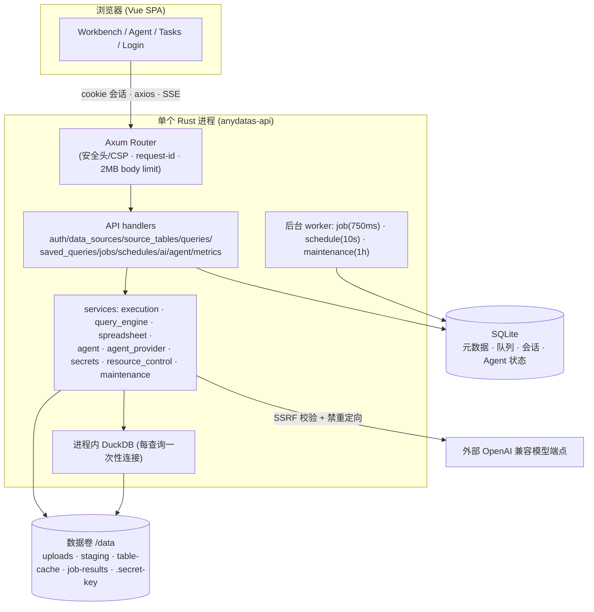
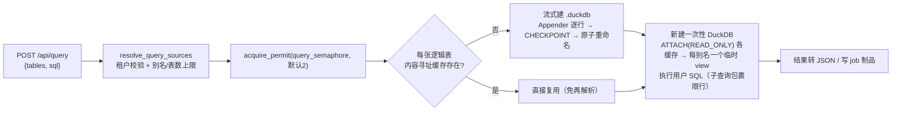

# AnyDatas 设计总览（提炼版 · 以实际代码为准）

- 更新日期: 2026-07-26
- 目的: 从**当前实际运行的代码**中提炼一份「读一遍就能建立正确心智模型」的设计文档。
- 权威来源: `backend/`、`frontend/`、`backend/migrations/`，以及 `docs/11`、`docs/13–17` 与根 `README.md`。

> ⚠️ **文档漂移提醒（重要）**：`docs/00–10`、`docs/12` 描述的是**最初的宏大多租户愿景**（Next.js + FastAPI 控制面 + PostgreSQL + Redis + S3/MinIO + Docker 沙箱 Runner + ClickHouse + K8s 演进），并**未落地**。实际系统是一个**单 Rust 进程 + SQLite + 进程内 DuckDB + Vue SPA** 的单机工作台。若只读 `docs/04`，会建立完全错误的架构印象。本文以代码为准。（此漂移已在评审报告中作为发现记录。）

---

## 1. 一句话定位

AnyDatas 是一个**桌面优先、单服务器**的数据分析工作台：上传 Excel/CSV → 选择 Sheet/区间确认字段类型 → 跨文件/跨 Sheet 用 DuckDB SQL 分析 → 出多指标图表/导出 → 复杂查询转后台并可 cron 定时；并内置一个**服务端托管、可恢复的 AI Agent** 辅助写 SQL。

## 2. 技术栈与部署形态

| 层 | 选型 |
| --- | --- |
| Web API / 静态托管 / worker / 调度 | Rust 1.97 + Axum 0.8（单进程全包） |
| 元数据 | SQLite（WAL）+ SQLx 0.8（内嵌迁移） |
| 表格读取 | Calamine 0.36（xlsx/xls/xlsb/ods）+ csv |
| 查询引擎 | DuckDB 1.105（`bundled` 源码编译，进程内） |
| 前端 | Vue 3 + TS + Vite + Pinia + Element Plus + Monaco + ECharts 6 |
| 密钥 | AES-256-GCM，主密钥落 `/data/.secret-key` |
| 部署 | 单容器 + 单持久卷；**无** Redis / K8s / Temporal / Docker socket / 外部 worker |

## 3. 核心数据模型：三层

这是理解整个查询系统的钥匙。

1. **物理文件 (`data_sources`)** — 不可变的上传文件（Excel/CSV），只记录存储路径、媒体类型、Sheet 名等。
2. **逻辑表 (`source_tables`)** — 在某物理文件上定义的**具名单元格区间**（Sheet + 起止单元格 + 是否首行表头 + 字段类型）。同一 Sheet 可切成多张逻辑表。每张表有 `config_version`。
3. **查询绑定 (`{tableId, alias}` 有序列表)** — 一次查询把若干逻辑表以别名绑入，支持跨文件 JOIN 与同表自连接（多别名复用一次 ATTACH）。单次最多 16 张。

同一份「绑定快照」被交互查询、保存查询、后台任务、定时任务**完全一致地**复用；`source_id` 仅为兼容旧接口保留。

## 4. 查询执行与缓存（`services/query_engine.rs` · `execution.rs`）

关键设计：

- **内容寻址缓存**：`cache_key = SHA-256(range/version)`，首查建、后续免解析复用；`config_version` 变更即换新键，避免读到被覆盖的旧缓存；孤儿缓存按引用计数 GC。
- **并发由 owned 信号量许可控制**：许可被**移动进 `spawn_blocking` 闭包**——HTTP 侧超时返回客户端时，真实 DuckDB/calamine 工作仍持有槽位，防止重试风暴突破配置并发。
- **双阶段可取消**：DuckDB `InterruptHandle` 中断运行中 SQL；建缓存导入每 1024 行轮询取消集，超时/用户取消能在建缓存中途停下。（calamine 解析不可强杀——见评审 H2。）
- **只读 SQL 分层防护**：`validate_read_only_sql`（仅单条 SELECT/WITH + 关键字黑名单）+ 引擎级 `enable_external_access=false` + 禁扩展自动加载 + 只读 ATTACH + 标识符/字面量转义 + 服务端强制的 memory/threads/temp 上限（用户 `SET` 被禁，无法覆盖）。
- **大结果外置**：后台任务的完整结果写入 `job-results/<uuid>.duckdb` 独立制品（分页 + 流式 CSV），SQLite 只存有界样本 + 元数据；制品按保留期过期，审计记录（SQL/日志/耗时）保留。

## 5. 后台任务与调度（`workers.rs`）

以 SQLite 为持久队列，进程内三个 worker：

- **job worker（750ms）**：`SELECT` 最旧 `queued` → 用 `UPDATE ... WHERE id=? AND status='queued'` **原子认领**（查 `rows_affected`）→ 执行到制品 → 复查状态尊重中途取消 → 写成功（样本+制品key+过期时间）或失败（+删残制品）。
- **schedule worker（10s）**：对到期计划用 `UPDATE ... WHERE next_run_at<=?` **原子推进**下次运行时间（`rows_affected()==1` 才入队，防重复）。到期只补跑一次、不做风暴式补偿。
- **maintenance worker（1h）**：回收过期后台结果。
- **启动恢复**：`recover_interrupted_jobs`/`recover_interrupted_agent_runs` 把重启前残留的 `running` 收敛为 `failed`，UI 不会永久卡住。

> 已知取舍：job 实际**串行**（worker 循环 await 单个 job）；这是单机 MVP 的简化，评审 M7 建议认领后 `tokio::spawn` 以解队头阻塞。

## 6. AI Agent Runtime（`services/agent.rs` · `agent_provider.rs`，详见 `docs/17`）

**服务端权威**的 Agent：SQLite 是唯一事实源，进程内事件总线只传「版本号」唤醒 SSE 订阅者，订阅者再回库读完整快照——刷新/重连总能恢复。

- **会话 / Run / Step 三层**（migration 0006）：一个 Run 是一条用户消息对应的完整生命周期；Step 记录每次真实的模型决策与工具观察（前端展示真实轨迹，非模拟 loading）。partial unique index `idx_ai_runs_one_active` 用 DB 约束保证「每会话至多一个活跃 Run」。
- **原生 Chat Completions 工具**：`tools`/`tool_calls`，`parallel_tool_calls=false`；SSE 解析器按 `index` 拼接分片工具 JSON，**完整拼接后**才校验/执行；兼容非流式 JSON。
- **只读工具注册表**：仅 `preview_sql`（单条 SELECT/WITH，复用查询引擎全部安全边界，限 20 行）与 `inspect_table`（别名必须在服务端绑定内，`limit` 1–20）。未知工具/坏参数作为「失败工具观察」回给模型自我修正，不动态派发代码。
- **上下文签名守卫**：签名 = 有序 `tableId:alias:config_version`；有消息的会话不能静默换上下文（须新建会话），防止被取消的表经旧消息/候选 SQL/结果样本回流。空表会话不声明数据工具并防御性清除当前 SQL/结果样本。
- **确定性滚动摘要**：超预算时用**规则**（不调模型）压缩最旧消息，避免额外费用/递归超时/事实改写；最终 prompt 严格不超 `ANYDATAS_AGENT_CONTEXT_CHARS`，优先保留最新用户需求。
- **两层取消**：进程内 `AtomicBool + Notify` 唤醒模型等待；`InterruptHandle` 中断工具查询；所有状态 UPDATE 带 `WHERE status IN (running/queued)` 守卫，晚到的取消不会覆盖已完成 Run。
- **密钥**：API Key 以 AES-256-GCM 密文存库，仅在单次 Run 解密进内存；设置接口只回 `api_key_configured` 布尔，绝不回显、不落日志。

## 7. 安全模型（横切）

- **鉴权**：Argon2 加盐；会话 token = 双 UUID（256bit），库存 SHA-256 摘要；HttpOnly/SameSite=Lax cookie，`Secure` 可配；登录用 dummy hash 做恒定时间比较防枚举、`spawn_blocking` 防阻塞、email+ip 与 ip 双阈值限流。
- **RBAC**：`AuthContext.require_admin/require_analyst`，工作区 AI 配置仅 Owner/Admin；数据接口在 SQL 层用 `(? IS NULL OR workspace_id=?)` 强制租户隔离。（当前实际只会创建 owner，见评审 H3。）
- **AI 出站**：reqwest 禁重定向，`validate_base_url_network` 固定本次 DNS 解析结果，公网强制 HTTPS 并拒绝 URL 内嵌凭据；本机和局域网模型由工作区管理员直接配置。QuickJS `http.request` 另行使用部署级白名单和私网开关，两套策略不共享状态。
- **浏览器边界**：强 CSP、`X-Frame-Options: DENY`、nosniff、referrer-policy、permissions-policy；AI Markdown 经 DOMPurify 清洗；CSV 导出防公式注入（值已防、表头未防，见评审 M2）。
- **可观测**：`/api/metrics` 需 Bearer；只暴露低基数聚合（不含 user/workspace/path/SQL）。

## 8. 前端结构（`frontend/src`）

- **路由**：`AppShell` 下 `/workbench`、`/agent`、`/tasks` + 公开 `/login`；`router.beforeEach` 鉴权守卫。
- **状态**：Pinia `workspace`（物理源/逻辑表/查询绑定/保存查询）、`tasks`（轮询汇总）、`auth`。**Agent 表绑定与工作台查询绑定刻意分离**（`agentTableBindings` 独立 slice，默认空=纯对话不泄 schema），仅当二者完全一致才携带当前 SQL/结果样本。
- **性能预算**：Monaco、ECharts 动态 import 分块；`manualChunks` 仅固定 vue 运行时；`scripts/check-bundle.mjs` 强制入口预算；登录/Agent 页不付编辑器成本。
- **大结果**：DataGrid 对 >200 行虚拟化；job 结果按页（100/页）拉取，完整数据仅经直链 CSV 下载；制品过期时 UI 显示「结果已过期」。

## 9. 持久化 / 运维要点

- **迁移**：0001 元数据 → 0002 用户/工作区/会话/限流 → 0003 多表查询 → 0004 暂存导入 → 0005 工作区 AI → 0006 Agent 运行时 → 0007 reasoning effort → 0008 job 结果制品。全部内嵌，启动 `sqlx::migrate!` 自动执行。partial unique index 编码不变量（一源一默认表、一会话一活跃 Run）。
- **备份/恢复**：一致性优先的在线 SQLite 快照 + schema 校验 + 剥离可重建状态（staged_imports/table-cache/query-work）；归档必须在数据卷外；恢复防路径穿越/符号链接/非常规文件，带 on-volume 回滚副本直至成功。（备份含 `.secret-key`，见评审「备份即高敏」。）
- **CI**：backend / frontend / operations / container 四作业，container gated 在前三之后；`docker compose config -q` 校验每个 overlay，promtool 校验告警规则。（`upgrade.py`/`set_password.py` 未纳入 py_compile 且已漂移，见评审 H6。）

## 10. 设计取舍一览（值得记住）

| 取舍 | 收益 | 代价 / 已知边界 |
| --- | --- | --- |
| 单进程 + SQLite 队列 | 部署极简、无外部依赖 | 无实例锁；两进程同库会互相收敛在途任务 |
| owned 许可移入 blocking 线程 | HTTP 超时不会提前释放并发槽 | calamine 不可强杀，超时后线程仍在跑 |
| 内容寻址缓存 + config_version | 免重复解析、在途查询不读脏缓存 | 哈希无分隔符有碰撞风险（M6） |
| 大结果外置为 .duckdb 制品 | 主库保持小、可分页/流式 | 物化期间磁盘守卫是事后检查（M9） |
| Agent 服务端权威 + SSE | 刷新/重连可恢复、无本地存储损坏 | 进程重启中的 Run 标记 failed，不跨进程续跑 |
| 文档「保留计划、标注已落地」 | 保留路线图 | 未加醒目分隔，新人易被 `docs/04` 误导 |

---

**延伸阅读**：跨文件/跨 Sheet 模型 → `docs/15`；导入预检+图表+AI SQL → `docs/16`；Agent 运行时 → `docs/17`；实现状态与 API 覆盖 → `docs/14`。本文的评审发现 → `docs/review/CODE-REVIEW.md`；可复用技能 → `docs/review/SKILLS.md`。
